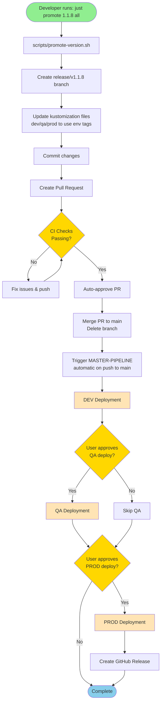
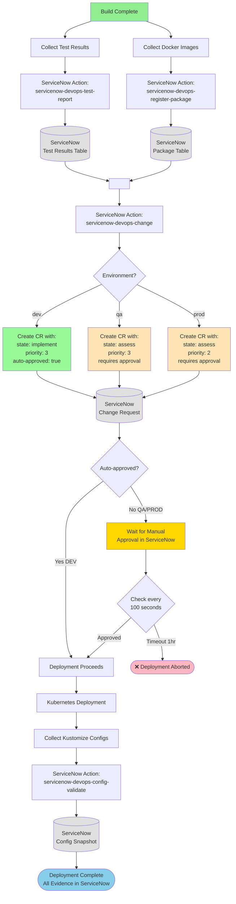
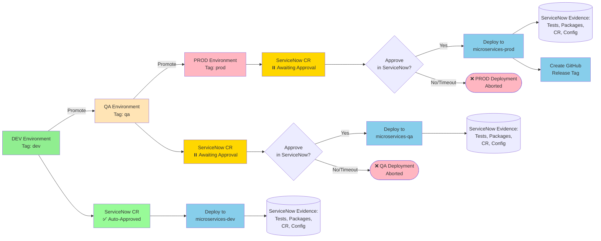
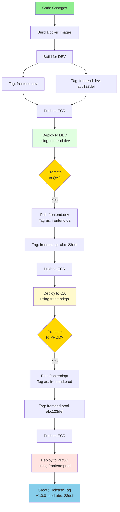
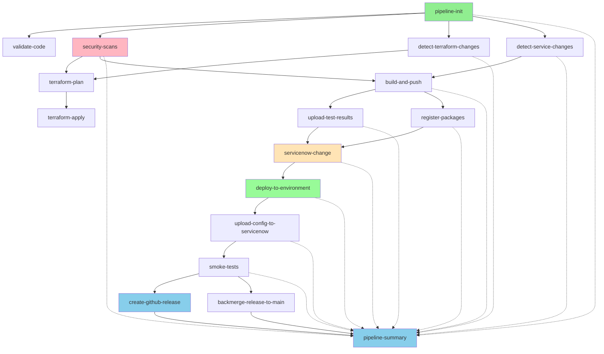
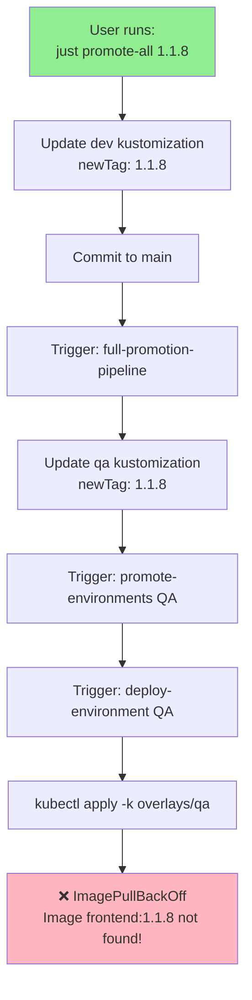
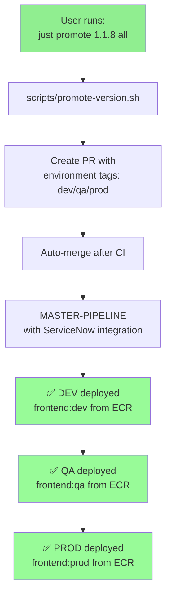
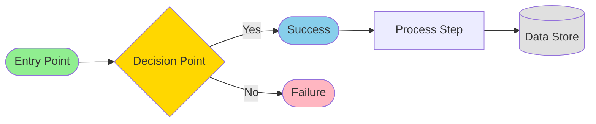

# Complete CI/CD Workflow Flowchart

> **Status**: Target Architecture (After Consolidation Complete)
> **Entry Point**: `just promote 1.1.8 all`

---

## High-Level Flow

---

## Detailed MASTER-PIPELINE Flow

```mermaid
flowchart TD
    Trigger([Push to main or<br/>Manual workflow_dispatch]) --> Init[Pipeline Init<br/>Determine environment]

    Init --> Policy{Branch Policy<br/>Check}
    Policy -->|Fail| BlockDeploy[❌ Block Deployment<br/>qa/prod require release/* branch]
    Policy -->|Pass| ParallelStart[ ]

    ParallelStart --> Validate[Code Validation<br/>Kustomize, YAML lint]
    ParallelStart --> Security[Security Scanning<br/>CodeQL, Trivy, Gitleaks]

    Validate --> ParallelEnd1[ ]
    Security --> ParallelEnd1

    ParallelEnd1 --> TFCheck{Terraform<br/>Changes?}
    TFCheck -->|Yes| TFPlan[Terraform Plan]
    TFCheck -->|No| ServiceCheck
    TFPlan --> TFApply{Apply<br/>Infrastructure?}
    TFApply -->|Yes| TFDo[Terraform Apply]
    TFApply -->|No| ServiceCheck
    TFDo --> ServiceCheck

    ServiceCheck{Service<br/>Changes?} -->|Yes| Build[Build Docker Images<br/>Smart change detection]
    ServiceCheck -->|No| DeployCheck

    Build --> BuildSuccess{Build<br/>Success?}
    BuildSuccess -->|No| Failed([❌ Pipeline Failed])
    BuildSuccess -->|Yes| ParallelSN[ ]

    ParallelSN --> UploadTests[Upload Test Results<br/>to ServiceNow]
    ParallelSN --> RegisterPkg[Register Packages<br/>in ServiceNow]

    UploadTests --> SNComplete[ ]
    RegisterPkg --> SNComplete

    SNComplete --> DeployCheck{Should<br/>Deploy?}
    DeployCheck -->|No PR| SNChange[Create ServiceNow<br/>Change Request]
    DeployCheck -->|PR| SkipDeploy([ℹ️ Build Only])

    SNChange --> AutoApprove{Environment<br/>= dev?}
    AutoApprove -->|Yes| DevCR[CR State: implement<br/>✅ Auto-Approved]
    AutoApprove -->|No| ManualCR[CR State: assess<br/>⏸️ Awaiting Approval]

    DevCR --> K8sDeploy
    ManualCR --> WaitApproval{ServiceNow<br/>Approved?}
    WaitApproval -->|Timeout| Failed
    WaitApproval -->|Yes| K8sDeploy

    K8sDeploy[Deploy to Kubernetes<br/>kubectl apply -k overlays/ENV] --> Rollout[Wait for Rollout<br/>10 minute timeout]

    Rollout --> RolloutOK{Rollout<br/>Success?}
    RolloutOK -->|No| Failed
    RolloutOK -->|Yes| UploadConfig[Upload Config<br/>to ServiceNow]

    UploadConfig --> Smoke[Smoke Tests<br/>Pod health, frontend URL]

    Smoke --> SmokeOK{Smoke Tests<br/>Pass?}
    SmokeOK -->|No| Failed
    SmokeOK -->|Yes| IsProd{Environment<br/>= prod?}

    IsProd -->|Yes| CreateTag[Create Git Tag<br/>GitHub Release]
    IsProd -->|No| Summary
    CreateTag --> IsRelease{On release/*<br/>branch?}
    IsRelease -->|Yes| Backmerge[Create Backmerge PR<br/>to main]
    IsRelease -->|No| Summary
    Backmerge --> Summary

    Summary[Pipeline Summary<br/>with ServiceNow details] --> Success([✅ Deployment Complete])

    style Trigger fill:#90EE90
    style Success fill:#87CEEB
    style Failed fill:#FFB6C1
    style SkipDeploy fill:#D3D3D3
    style BlockDeploy fill:#FFB6C1
    style DevCR fill:#98FB98
    style ManualCR fill:#FFE4B5
    style AutoApprove fill:#FFD700
    style Policy fill:#FFD700
    style TFCheck fill:#FFD700
    style ServiceCheck fill:#FFD700
    style BuildSuccess fill:#FFD700
    style DeployCheck fill:#FFD700
    style WaitApproval fill:#FFD700
    style RolloutOK fill:#FFD700
    style SmokeOK fill:#FFD700
    style IsProd fill:#FFD700
    style IsRelease fill:#FFD700
```

---

## ServiceNow Integration Flow

---

## Environment Promotion Flow

---

## Image Tagging Flow

---

## Job Dependency Graph

---

## Automated Promotion Script Flow

```mermaid
flowchart TD
    Start([just promote 1.1.8 all]) --> Checkout[git checkout main<br/>git pull origin main]

    Checkout --> CreateBranch[git checkout -b release/v1.1.8]

    CreateBranch --> UpdateDev[Update kustomize/overlays/dev:<br/>newTag: dev]
    UpdateDev --> UpdateQA[Update kustomize/overlays/qa:<br/>newTag: qa]
    UpdateQA --> UpdateProd[Update kustomize/overlays/prod:<br/>newTag: prod]

    UpdateProd --> Commit[git commit -m<br/>'chore: Promote to version 1.1.8']

    Commit --> Push[git push origin release/v1.1.8]

    Push --> CreatePR[gh pr create<br/>--base main<br/>--head release/v1.1.8]

    CreatePR --> WaitCI[Wait for CI checks<br/>gh pr checks --watch]

    WaitCI --> CIPassed{CI Checks<br/>Passed?}
    CIPassed -->|No| ShowError[Show error<br/>Exit with instructions]
    CIPassed -->|Yes| AutoReview[gh pr review --approve]

    AutoReview --> AutoMerge[gh pr merge --squash<br/>--delete-branch --auto]

    AutoMerge --> UpdateMain[git checkout main<br/>git pull origin main]

    UpdateMain --> WaitPipeline[Wait for MASTER-PIPELINE<br/>to start on push to main]

    WaitPipeline --> DevRun[Get DEV workflow run ID<br/>gh run list --limit 1]

    DevRun --> WatchDev[Watch DEV deployment<br/>gh run watch RUN_ID]

    WatchDev --> DevDone{DEV<br/>Success?}
    DevDone -->|No| DevFailed([❌ DEV Failed])
    DevDone -->|Yes| DevComplete[✅ DEV Deployment Complete<br/>ServiceNow CR Auto-Approved]

    DevComplete --> PromptQA{Prompt:<br/>Deploy to QA?}
    PromptQA -->|No| SkipQA[Skip QA]
    PromptQA -->|Yes| TriggerQA[gh workflow run MASTER-PIPELINE<br/>-f environment=qa]

    TriggerQA --> WatchQA[Watch QA deployment<br/>gh run watch RUN_ID]

    WatchQA --> QAApproval[⏸️ Waiting for<br/>ServiceNow CR Approval]

    QAApproval --> QADone{QA<br/>Success?}
    QADone -->|No| QAFailed([❌ QA Failed])
    QADone -->|Yes| QAComplete[✅ QA Deployment Complete]

    QAComplete --> PromptProd
    SkipQA --> PromptProd

    PromptProd{Prompt:<br/>Deploy to PROD?}
    PromptProd -->|No| Complete
    PromptProd -->|Yes| TriggerProd[gh workflow run MASTER-PIPELINE<br/>-f environment=prod]

    TriggerProd --> WatchProd[Watch PROD deployment<br/>gh run watch RUN_ID]

    WatchProd --> ProdApproval[⏸️ Waiting for<br/>ServiceNow CR Approval]

    ProdApproval --> ProdDone{PROD<br/>Success?}
    ProdDone -->|No| ProdFailed([❌ PROD Failed])
    ProdDone -->|Yes| ProdComplete[✅ PROD Deployment Complete<br/>GitHub Release Created]

    ProdComplete --> Complete

    Complete([🎉 Version Promotion Complete<br/>Show Summary])

    style Start fill:#90EE90
    style Complete fill:#87CEEB
    style DevFailed fill:#FFB6C1
    style QAFailed fill:#FFB6C1
    style ProdFailed fill:#FFB6C1
    style ShowError fill:#FFB6C1
    style DevComplete fill:#98FB98
    style QAComplete fill:#FFE4B5
    style ProdComplete fill:#FFE4B5
    style PromptQA fill:#FFD700
    style PromptProd fill:#FFD700
    style CIPassed fill:#FFD700
    style DevDone fill:#FFD700
    style QADone fill:#FFD700
    style ProdDone fill:#FFD700
    style QAApproval fill:#FFD700
    style ProdApproval fill:#FFD700
```

---

## Comparison: Before vs After

### Before (Broken)

**Problems**:
- ❌ Semantic version tags (1.1.8) don't exist in ECR
- ❌ Multiple workflows (full-promotion-pipeline, promote-environments, deploy-environment)
- ❌ Broken logic spread across files
- ❌ No ServiceNow integration in MASTER-PIPELINE
- ❌ Manual git commits to main (no PR review)

### After (Fixed)

**Benefits**:
- ✅ Environment tags that exist in ECR
- ✅ Single workflow (MASTER-PIPELINE)
- ✅ Complete ServiceNow integration
- ✅ Proper PR workflow with CI checks
- ✅ Automated promotion script

---

## Legend

**Colors**:
- 🟢 Green: Start/trigger points
- 🔵 Blue: Success/completion
- 🔴 Pink: Failure/error states
- 🟡 Yellow: Decision points/waiting states
- ⚪ Gray: Data stores (ServiceNow tables)
- 🟠 Orange: Manual approval required
- 🟣 Light green: Automated approvals

---

## Key Takeaways

**Automation Points**:
1. ✅ Feature branch creation
2. ✅ Kustomization file updates
3. ✅ PR creation and merge
4. ✅ DEV deployment (auto-approved)
5. ⏸️ QA deployment (manual trigger + ServiceNow approval)
6. ⏸️ PROD deployment (manual trigger + ServiceNow approval)
7. ✅ GitHub release creation

**ServiceNow Touchpoints**:
1. Test results upload (after build)
2. Package registration (after build)
3. Change Request creation (before deployment)
4. Config upload (after deployment)

**Manual Intervention Points**:
1. QA deployment approval (in ServiceNow)
2. PROD deployment approval (in ServiceNow)
3. Optional: Skip QA/PROD in promotion script

**Safety Gates**:
1. CI checks must pass before PR merge
2. Branch policy enforcement (qa/prod require release/* branches)
3. ServiceNow CR approval for qa/prod
4. Rollout status monitoring
5. Smoke tests before marking success
