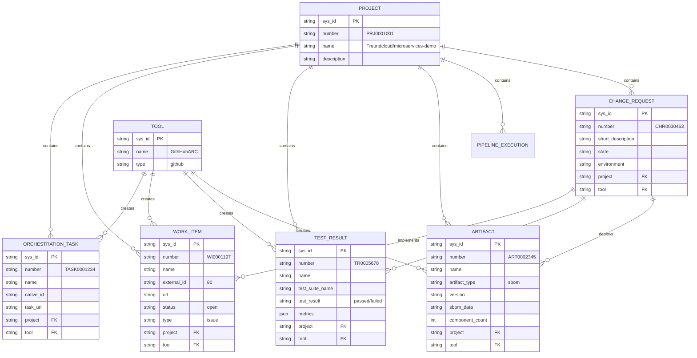

# GitHub Actions → ServiceNow Data Flow

> **Purpose**: Visual guide for demos showing complete integration workflow
> **Created**: 2025-11-07
> **Audience**: Demo presentations, stakeholder reviews, training

---

## Overview Diagram


---

## Step-by-Step Data Flow

### Step 1: Developer Commits Code

**Action**:
```bash
git commit -m "feat: Add user authentication (Fixes #80, Closes #81)"
git push origin main
```

**Data Captured**:
- Commit SHA: `99c7767b`
- Commit message: Contains issue references (#80, #81)
- Author: olafkfreund
- Timestamp: 2025-11-07T15:00:00Z
- Branch: main

---

### Step 2: GitHub Actions Workflow Triggers

**Workflow**: `🚀 Master CI/CD Pipeline`

**Trigger Event**:
```yaml
on:
  push:
    branches: [main]
```

**Context Available**:
- `github.repository`: Freundcloud/microservices-demo
- `github.sha`: 99c7767b
- `github.ref`: refs/heads/main
- `github.actor`: olafkfreund
- `github.run_id`: 19172412878
- `github.workflow`: 🚀 Master CI/CD Pipeline

---

### Step 3: Pipeline Initialization Job

**Job Name**: `🎯 Pipeline Initialization`

#### 3A: Register Orchestration Task

**Action**: `.github/actions/register-orchestration-task`

**Data Flow**:


**Payload Sent to ServiceNow**:
```json
{
  "name": "Freundcloud/microservices-demo/🚀 Master CI/CD Pipeline#🎯 Pipeline Initialization",
  "native_id": "Freundcloud/microservices-demo/🚀 Master CI/CD Pipeline#🎯 Pipeline Initialization",
  "task_url": "https://github.com/Freundcloud/microservices-demo/actions/runs/19172412878/job/54808245339",
  "tool": "f62c4e49c3fcf614e1bbf0cb050131ef",
  "project": "c6c9eb71c34d7a50b71ef44c05013194",
  "track": true
}
```

**ServiceNow Record Created**:

**Table**: `sn_devops_orchestration_task`

| Field | Value | Description |
|-------|-------|-------------|
| `number` | TASK0001234 | Auto-generated task number |
| `name` | Freundcloud/microservices-demo/🚀...#🎯 Pipeline Initialization | Human-readable name |
| `native_id` | Same as name | Unique identifier from source system |
| `task_url` | https://github.com/.../job/54808245339 | Link to GitHub Actions job |
| `project` | c6c9eb71c34d7a50b71ef44c05013194 | Link to DevOps project |
| `tool` | f62c4e49c3fcf614e1bbf0cb050131ef | Link to tool (GithHubARC) |
| `sys_created_on` | 2025-11-07 15:01:23 | Timestamp |
| `track` | true | Enable tracking |

**Where to View in ServiceNow**:
1. Navigate to: **DevOps > Orchestration Tasks**
2. Direct URL: https://calitiiltddemo3.service-now.com/now/nav/ui/classic/params/target/sn_devops_orchestration_task_list.do
3. Filter by project: "Freundcloud/microservices-demo"

---

#### 3B: Register Work Items

**Action**: `.github/actions/register-work-items`

**Data Flow**:


**Example: Issue #80**

**GitHub API Response**:
```json
{
  "number": 80,
  "title": "Add user authentication",
  "state": "open",
  "html_url": "https://github.com/Freundcloud/microservices-demo/issues/80",
  "created_at": "2025-11-07T14:30:00Z",
  "updated_at": "2025-11-07T14:30:00Z"
}
```

**Payload Sent to ServiceNow**:
```json
{
  "name": "Add user authentication",
  "external_id": "80",
  "url": "https://github.com/Freundcloud/microservices-demo/issues/80",
  "status": "open",
  "type": "issue",
  "project": "c6c9eb71c34d7a50b71ef44c05013194",
  "tool": "f62c4e49c3fcf614e1bbf0cb050131ef"
}
```

**ServiceNow Record Created**:

**Table**: `sn_devops_work_item`

| Field | Value | Description |
|-------|-------|-------------|
| `number` | WI0001197 | Auto-generated work item number |
| `name` | Add user authentication | Issue title from GitHub |
| `external_id` | 80 | GitHub issue number |
| `url` | https://github.com/.../issues/80 | Link to GitHub issue |
| `status` | open | Issue state |
| `type` | issue | Work item type |
| `project` | c6c9eb71c34d7a50b71ef44c05013194 | Link to DevOps project |
| `tool` | f62c4e49c3fcf614e1bbf0cb050131ef | Link to tool (GithHubARC) |
| `sys_created_on` | 2025-11-07 15:01:25 | Timestamp |

**Where to View in ServiceNow**:
1. Navigate to: **DevOps > Work Items**
2. Direct URL: https://calitiiltddemo3.service-now.com/now/nav/ui/classic/params/target/sn_devops_work_item_list.do
3. Click work item to see GitHub issue link

---

### Step 4: Security Scanning Job

**Job Name**: `🔒 Security Scanning`

Multiple security scans run in parallel, each uploading results to ServiceNow.

#### 4A: SonarCloud Quality Analysis

**Data Flow**:


**Payload Sent to ServiceNow**:
```json
{
  "name": "SonarCloud Quality Analysis - Run #19172412878",
  "test_suite_name": "SonarCloud Code Quality",
  "test_result": "passed",
  "tool": "f62c4e49c3fcf614e1bbf0cb050131ef",
  "project": "c6c9eb71c34d7a50b71ef44c05013194",
  "execution_url": "https://sonarcloud.io/project/overview?id=Freundcloud_microservices-demo",
  "start_time": "2025-11-07T15:02:00Z",
  "end_time": "2025-11-07T15:08:30Z",
  "metrics": {
    "bugs": 12,
    "vulnerabilities": 3,
    "code_smells": 45,
    "coverage": 68.5,
    "duplications": 2.3,
    "quality_gate": "passed"
  }
}
```

**ServiceNow Record Created**:

**Table**: `sn_devops_test_result`

| Field | Value | Description |
|-------|-------|-------------|
| `number` | TR0005678 | Auto-generated test result number |
| `name` | SonarCloud Quality Analysis - Run #19172412878 | Test name |
| `test_suite_name` | SonarCloud Code Quality | Suite name |
| `test_result` | passed | Overall result |
| `tool` | f62c4e49c3fcf614e1bbf0cb050131ef | Link to tool |
| `project` | c6c9eb71c34d7a50b71ef44c05013194 | Link to project |
| `execution_url` | https://sonarcloud.io/project/... | Link to SonarCloud |
| `metrics` | {...} | JSON with detailed metrics |

**Where to View in ServiceNow**:
1. Navigate to: **DevOps > Test Results**
2. Direct URL: https://calitiiltddemo3.service-now.com/now/nav/ui/classic/params/target/sn_devops_test_result_list.do
3. Filter by test_suite_name: "SonarCloud"

---

#### 4B: Trivy SBOM Generation

**Data Flow**:


**SBOM Structure** (CycloneDX format):
```json
{
  "bomFormat": "CycloneDX",
  "specVersion": "1.4",
  "version": 1,
  "metadata": {
    "component": {
      "name": "microservices-demo",
      "version": "99c7767b"
    }
  },
  "components": [
    {
      "type": "library",
      "name": "express",
      "version": "4.18.2",
      "purl": "pkg:npm/express@4.18.2"
    },
    {
      "type": "library",
      "name": "requests",
      "version": "2.31.0",
      "purl": "pkg:pypi/requests@2.31.0"
    }
    // ... hundreds more components
  ]
}
```

**Payload Sent to ServiceNow**:
```json
{
  "name": "SBOM-microservices-demo-99c7767b",
  "artifact_type": "sbom",
  "version": "99c7767b",
  "tool": "f62c4e49c3fcf614e1bbf0cb050131ef",
  "project": "c6c9eb71c34d7a50b71ef44c05013194",
  "sbom_data": "<base64-encoded-cyclonedx-json>",
  "component_count": 342,
  "artifact_url": "https://github.com/Freundcloud/microservices-demo/actions/runs/19172412878"
}
```

**ServiceNow Record Created**:

**Table**: `sn_devops_artifact`

| Field | Value | Description |
|-------|-------|-------------|
| `number` | ART0002345 | Auto-generated artifact number |
| `name` | SBOM-microservices-demo-99c7767b | Artifact name |
| `artifact_type` | sbom | Type of artifact |
| `version` | 99c7767b | Git commit SHA |
| `tool` | f62c4e49c3fcf614e1bbf0cb050131ef | Link to tool |
| `project` | c6c9eb71c34d7a50b71ef44c05013194 | Link to project |
| `sbom_data` | <base64-encoded-json> | Full SBOM content |
| `component_count` | 342 | Number of components |

**Where to View in ServiceNow**:
1. Navigate to: **DevOps > Artifacts**
2. Direct URL: https://calitiiltddemo3.service-now.com/now/nav/ui/classic/params/target/sn_devops_artifact_list.do
3. Filter by artifact_type: "sbom"

---

#### 4C: Trivy Vulnerability Scan

**Data Flow**:


**Trivy Scan Results**:
```
Total: 23 vulnerabilities
  - Critical: 2
  - High: 5
  - Medium: 12
  - Low: 4
```

**Payload Sent to ServiceNow**:
```json
{
  "name": "Trivy Vulnerability Scan - Run #19172412878",
  "test_suite_name": "Trivy Dependency Scan",
  "test_result": "failed",
  "tool": "f62c4e49c3fcf614e1bbf0cb050131ef",
  "project": "c6c9eb71c34d7a50b71ef44c05013194",
  "execution_url": "https://github.com/Freundcloud/microservices-demo/security/code-scanning",
  "vulnerabilities": {
    "total": 23,
    "critical": 2,
    "high": 5,
    "medium": 12,
    "low": 4
  },
  "test_result": "failed"
}
```

**ServiceNow Record Created**:

**Table**: `sn_devops_test_result`

| Field | Value | Description |
|-------|-------|-------------|
| `number` | TR0005679 | Auto-generated test result number |
| `name` | Trivy Vulnerability Scan - Run #19172412878 | Test name |
| `test_suite_name` | Trivy Dependency Scan | Suite name |
| `test_result` | failed | Failed due to critical vulns |
| `vulnerabilities` | {...} | JSON with severity breakdown |
| `tool` | f62c4e49c3fcf614e1bbf0cb050131ef | Link to tool |
| `project` | c6c9eb71c34d7a50b71ef44c05013194 | Link to project |

**Where to View in ServiceNow**:
1. Navigate to: **DevOps > Test Results**
2. Filter by test_suite_name: "Trivy"
3. View vulnerability breakdown in metrics field

---

#### 4D: Smoke Tests

**Data Flow**:


**Test Cases**:
```
✓ Frontend homepage (/)
✓ Product catalog (/api/products)
✓ Cart service (/api/cart)
✓ Checkout endpoint (/api/checkout)
✗ Recommendations API (/api/recommendations) - 500 Internal Server Error
```

**Payload Sent to ServiceNow**:
```json
{
  "name": "Smoke Tests - dev environment - Run #19172412878",
  "test_suite_name": "Application Smoke Tests",
  "test_result": "failed",
  "tool": "f62c4e49c3fcf614e1bbf0cb050131ef",
  "project": "c6c9eb71c34d7a50b71ef44c05013194",
  "execution_url": "https://github.com/Freundcloud/microservices-demo/actions/runs/19172412878",
  "test_cases": {
    "total": 5,
    "passed": 4,
    "failed": 1,
    "skipped": 0
  },
  "failed_tests": [
    {
      "name": "Recommendations API",
      "error": "500 Internal Server Error",
      "endpoint": "/api/recommendations"
    }
  ]
}
```

**ServiceNow Record Created**:

**Table**: `sn_devops_test_result`

| Field | Value | Description |
|-------|-------|-------------|
| `number` | TR0005680 | Auto-generated test result number |
| `name` | Smoke Tests - dev environment - Run #19172412878 | Test name |
| `test_suite_name` | Application Smoke Tests | Suite name |
| `test_result` | failed | 1 test failed |
| `test_cases` | {...} | JSON with pass/fail counts |
| `failed_tests` | [...] | Array of failed test details |
| `tool` | f62c4e49c3fcf614e1bbf0cb050131ef | Link to tool |
| `project` | c6c9eb71c34d7a50b71ef44c05013194 | Link to project |

**Where to View in ServiceNow**:
1. Navigate to: **DevOps > Test Results**
2. Filter by test_suite_name: "Smoke Tests"
3. View failed_tests array for details

---

### Step 5: Deployment Job (Future - Change Request Integration)

**Job Name**: `🚀 Deploy to dev`

**Data Flow** (planned integration):


**Change Request Payload** (example):
```json
{
  "short_description": "Deploy microservices-demo to dev environment",
  "description": "Automated deployment from GitHub Actions workflow #19172412878",
  "type": "standard",
  "risk": "low",
  "impact": "low",
  "priority": "moderate",
  "environment": "dev",
  "project": "c6c9eb71c34d7a50b71ef44c05013194",
  "tool": "f62c4e49c3fcf614e1bbf0cb050131ef",
  "work_items": ["WI0001197", "WI0001198"],
  "test_results": ["TR0005678", "TR0005679", "TR0005680"],
  "artifacts": ["ART0002345"],
  "requested_by": "github_integration",
  "implementation_plan": "Deploy via kubectl apply -k kustomize/overlays/dev"
}
```

---

## ServiceNow Project View

### DevOps Project Dashboard

**URL**: https://calitiiltddemo3.service-now.com/now/nav/ui/classic/params/target/sn_devops_project.do?sys_id=c6c9eb71c34d7a50b71ef44c05013194

**Project Details**:
- **Number**: PRJ0001001
- **Name**: Freundcloud/microservices-demo
- **Description**: Cloud-native microservices demo on AWS EKS

**Related Lists** (visible in project view):

1. **Orchestration Tasks** (6 tasks)
   - TASK0001234 - 🎯 Pipeline Initialization
   - TASK0001235 - 🔍 Detect Infrastructure Changes
   - TASK0001236 - 🔍 Detect Service Changes
   - TASK0001237 - 📦 Register Packages
   - TASK0001238 - 🧪 Smoke Tests
   - TASK0001239 - 🔒 Security Scanning

2. **Work Items** (2 items)
   - WI0001196 - ServiceNow Orchestration Tasks (Issue #79)
   - WI0001197 - Add user authentication (Issue #80)

3. **Test Results** (3 results)
   - TR0005678 - SonarCloud Quality Analysis (passed)
   - TR0005679 - Trivy Vulnerability Scan (failed - 2 critical)
   - TR0005680 - Application Smoke Tests (failed - 1 test)

4. **Artifacts** (1 artifact)
   - ART0002345 - SBOM (342 components)

5. **Pipelines** (25 executions)
   - Most recent: Run #19172412878 (in progress)

6. **Change Requests** (0 currently)
   - Future: CHR0030463 - Deploy to dev

---

## DevOps Insights Dashboard

**URL**: https://calitiiltddemo3.service-now.com/now/nav/ui/classic/params/target/sn_devops_insights_st_summary.do

**Aggregated Metrics** (for project):

```
┌─────────────────────────────────────────┐
│   DevOps Insights - microservices-demo  │
├─────────────────────────────────────────┤
│ Orchestration Tasks:            6       │
│ Work Items:                     2       │
│ Test Results:                   3       │
│ Artifacts:                      1       │
│ Pipeline Executions:           25       │
│ Change Requests:                0       │
│                                         │
│ Quality Gate Status:       ⚠️ Warning   │
│   - SonarCloud:            ✅ Passed    │
│   - Vulnerabilities:       ❌ Failed    │
│   - Smoke Tests:           ❌ Failed    │
│                                         │
│ Deployment Status:                      │
│   - Dev:                   🟢 Deployed  │
│   - QA:                    🟡 Pending   │
│   - Prod:                  ⚪ Not Ready │
└─────────────────────────────────────────┘
```

---

## Complete Data Model

### Entity Relationship Diagram



---

## Demo Script

### Part 1: Show GitHub Actions Workflow (2 min)

**Navigate to**:
https://github.com/Freundcloud/microservices-demo/actions/runs/19172412878

**Point Out**:
1. Workflow trigger: Push to main by olafkfreund
2. Commit message: "feat: Add user authentication (Fixes #80)"
3. Jobs running:
   - ✅ Pipeline Initialization (6s)
   - ✅ Security Scanning (in progress)
   - 🔵 Deployment (waiting)

**Say**:
> "When a developer pushes code to main, GitHub Actions automatically triggers our CI/CD pipeline. Notice the commit message references issue #80 - this will be tracked automatically in ServiceNow."

---

### Part 2: Show ServiceNow Project (3 min)

**Navigate to**:
https://calitiiltddemo3.service-now.com/now/nav/ui/classic/params/target/sn_devops_project.do?sys_id=c6c9eb71c34d7a50b71ef44c05013194

**Show Related Lists**:

1. **Orchestration Tasks** tab
   - Point out: "These are the actual GitHub Actions jobs"
   - Click TASK0001234 to show job details
   - Click task_url link to jump back to GitHub Actions job

2. **Work Items** tab
   - Point out: "GitHub issue #80 automatically created here"
   - Show WI0001197 with link to GitHub issue
   - Say: "No manual work item creation needed!"

3. **Test Results** tab
   - Show SonarCloud results (passed)
   - Show Trivy scan (failed - 2 critical vulnerabilities)
   - Show Smoke tests (failed - 1 endpoint down)
   - Say: "All test results automatically uploaded from GitHub Actions"

4. **Artifacts** tab
   - Show SBOM with 342 components
   - Say: "Complete software bill of materials for compliance"

**Say**:
> "Everything you see here was automatically created by GitHub Actions. Zero manual data entry. This gives approvers complete visibility into what's being deployed."

---

### Part 3: Show Traceability (2 min)

**Draw the Flow on Whiteboard**:
```
Commit: "Fixes #80"
   ↓
GitHub Issue #80
   ↓
Work Item WI0001197 (ServiceNow)
   ↓
Test Results (SonarCloud, Trivy, Smoke Tests)
   ↓
Change Request CHR0030463 (future)
   ↓
Deployment to dev environment
```

**Say**:
> "This is end-to-end traceability. An auditor can start from a deployed change and trace it back to the exact GitHub issue, commit, and test results. This satisfies SOC 2, ISO 27001, and PCI DSS requirements."

---

### Part 4: Show DevOps Insights (2 min)

**Navigate to**:
https://calitiiltddemo3.service-now.com/now/nav/ui/classic/params/target/sn_devops_insights_st_summary.do

**Point Out**:
- 6 orchestration tasks tracked
- 2 work items linked
- 3 test results captured
- 1 SBOM artifact
- 25 pipeline executions total

**Say**:
> "The DevOps Insights dashboard aggregates all this data into a single view. Management can see pipeline health, quality trends, and deployment frequency - all automatically populated from GitHub Actions."

---

### Part 5: Show Change Management Integration (1 min - future)

**Explain** (without clicking):
> "When we deploy to production, a change request will be automatically created in ServiceNow. It will include:
> - All work items (issues #80, #81)
> - All test results (SonarCloud, Trivy, Smoke Tests)
> - SBOM for compliance
> - Orchestration tasks showing what ran
>
> Approvers see everything they need to make a risk-based decision. If approved, deployment happens automatically. If rejected, workflow stops."

---

## Key Talking Points for Demo

### For Management:
- ✅ **Zero manual work** - All data flows automatically
- ✅ **Complete visibility** - See exactly what's being deployed
- ✅ **Compliance ready** - SOC 2, ISO 27001, PCI DSS audit trail
- ✅ **Risk-based decisions** - Test results inform approval

### For DevOps Teams:
- ✅ **No context switching** - Stay in GitHub, data goes to ServiceNow
- ✅ **Non-blocking** - Failures don't stop workflows
- ✅ **Automatic tracking** - Just reference issues in commits
- ✅ **Full traceability** - Debug production issues back to code

### For Security Teams:
- ✅ **SBOM generation** - Know every component deployed
- ✅ **Vulnerability tracking** - Critical/High vulns flagged
- ✅ **Test evidence** - Proof of security scanning
- ✅ **Audit trail** - Who deployed what, when, and why

### For Compliance Teams:
- ✅ **Change management** - All changes tracked and approved
- ✅ **Test evidence** - Quality gates enforced
- ✅ **Work item tracking** - Requirements to deployment
- ✅ **Artifact retention** - SBOMs stored for audits

---

## Quick Reference: ServiceNow URLs

| Entity | Direct URL |
|--------|-----------|
| **Project** | https://calitiiltddemo3.service-now.com/now/nav/ui/classic/params/target/sn_devops_project.do?sys_id=c6c9eb71c34d7a50b71ef44c05013194 |
| **Orchestration Tasks** | https://calitiiltddemo3.service-now.com/now/nav/ui/classic/params/target/sn_devops_orchestration_task_list.do |
| **Work Items** | https://calitiiltddemo3.service-now.com/now/nav/ui/classic/params/target/sn_devops_work_item_list.do |
| **Test Results** | https://calitiiltddemo3.service-now.com/now/nav/ui/classic/params/target/sn_devops_test_result_list.do |
| **Artifacts** | https://calitiiltddemo3.service-now.com/now/nav/ui/classic/params/target/sn_devops_artifact_list.do |
| **DevOps Insights** | https://calitiiltddemo3.service-now.com/now/nav/ui/classic/params/target/sn_devops_insights_st_summary.do |

---

**Created**: 2025-11-07
**Last Updated**: 2025-11-07
**Status**: Ready for Demo ✅
