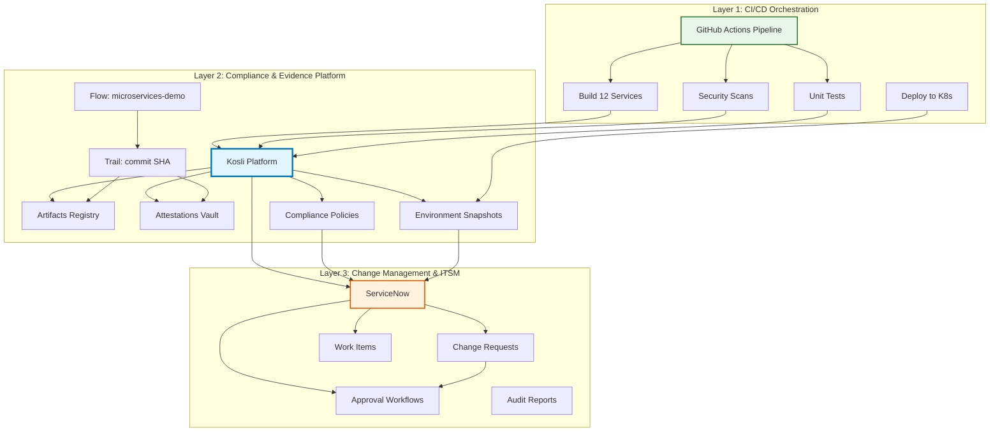
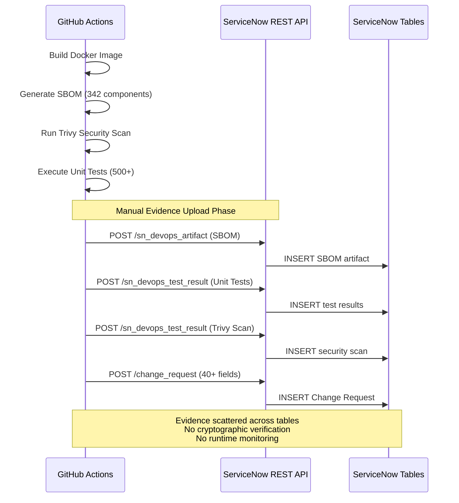
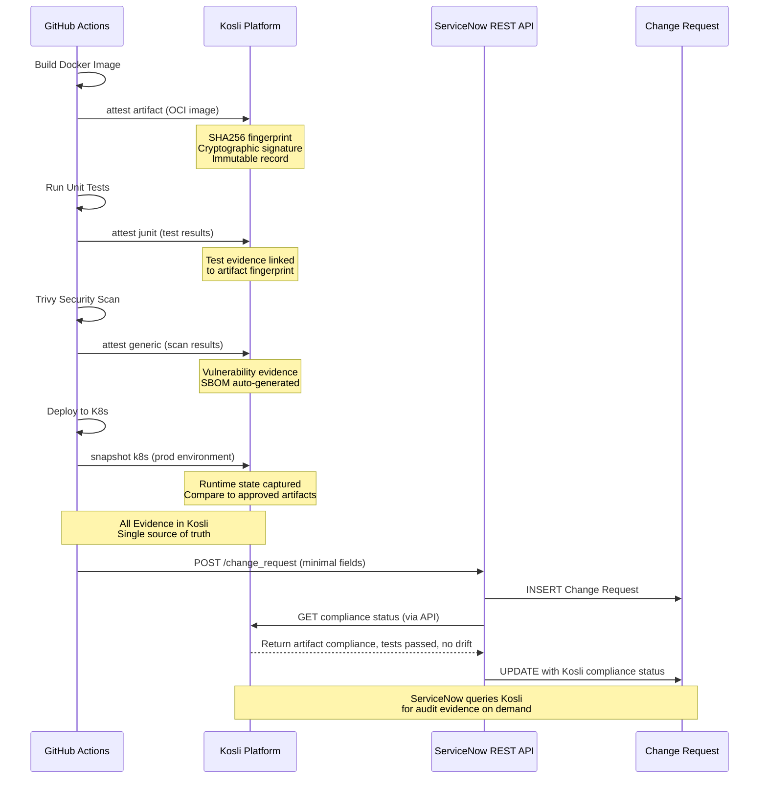
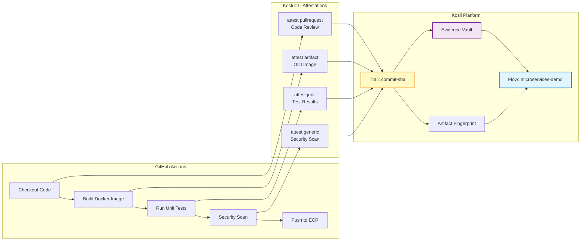
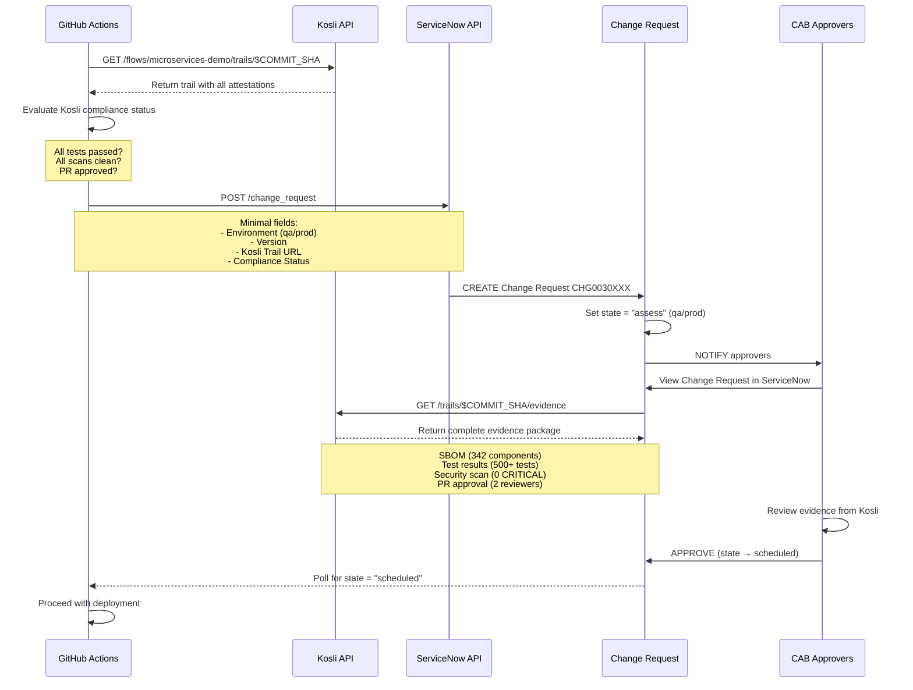
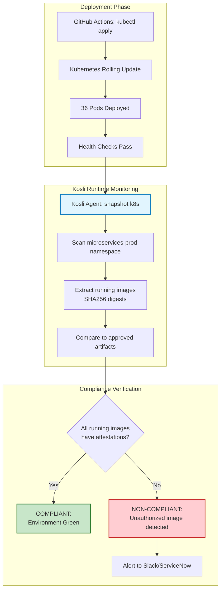
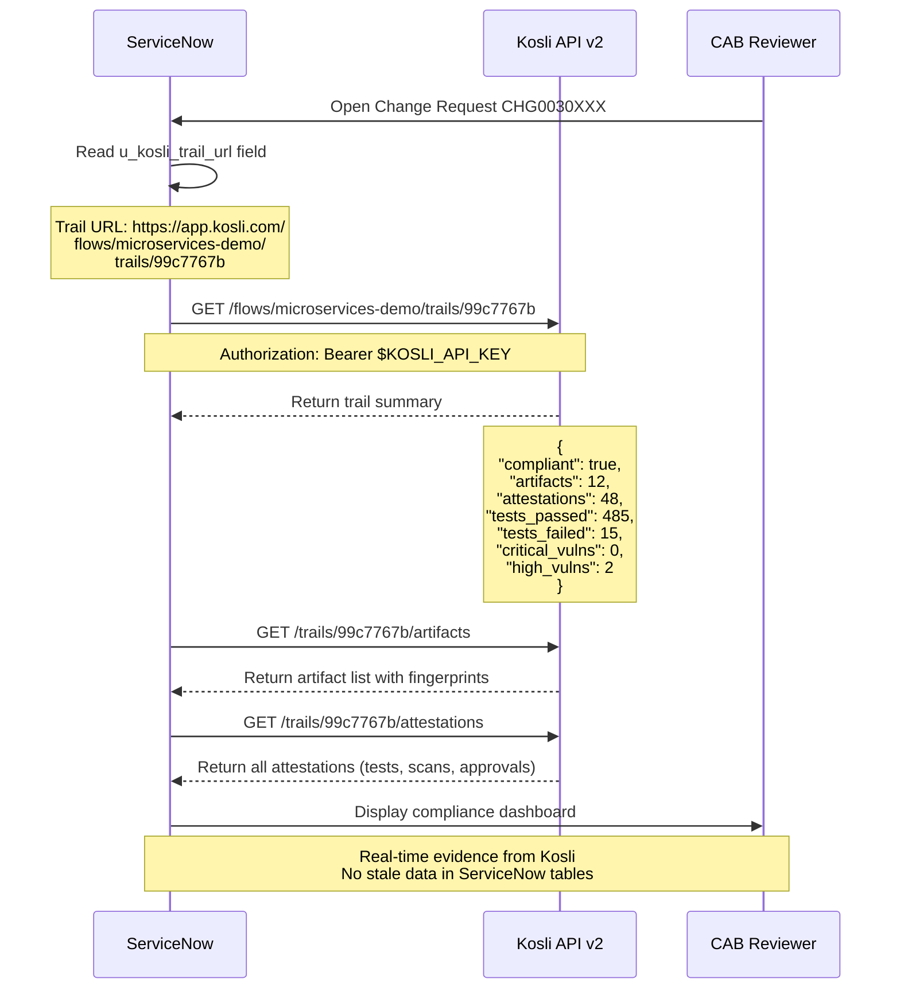
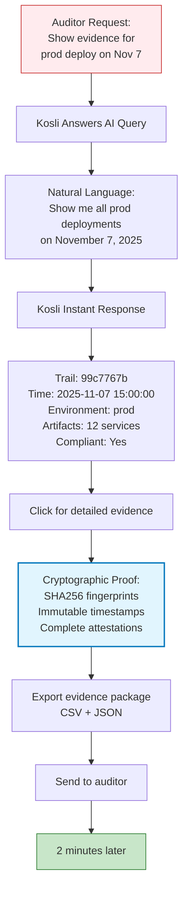

# GitHub-ServiceNow-Kosli Integration Architecture (KARC)

> Kosli-Augmented Release Center: Modern Compliance-First DevOps
> Last Updated: 2025-11-12
> Status: Reference Architecture
> Version: 2.0

## Executive Summary

This document presents the **KARC (Kosli-Augmented Release Center)** architecture—a modern DevOps compliance solution that leverages **Kosli as the central evidence and compliance platform** integrated with GitHub Actions and ServiceNow. This architecture delivers automated evidence collection, cryptographically-verifiable audit trails, and real-time production compliance monitoring.

### Why Kosli?

Traditional DevOps compliance approaches struggle with:

- ❌ **Manual evidence collection** - Engineers spend hours compiling audit evidence
- ❌ **No tamper protection** - Evidence stored in mutable databases
- ❌ **Build-time only** - No visibility into what's actually running in production
- ❌ **Slow audit response** - Hours or days to gather compliance proof
- ❌ **Complex integrations** - Dozens of REST API calls to track deployments

**KARC with Kosli solves these challenges:**

- ✅ **Automated attestation** - Evidence captured automatically during CI/CD
- ✅ **Cryptographic proof** - SHA256 fingerprints, immutable audit trail
- ✅ **Runtime monitoring** - Continuous scanning of production environments
- ✅ **Instant audit response** - Minutes to retrieve complete compliance evidence
- ✅ **Simple integration** - 4-5 CLI commands replace complex API workflows

### Key Capabilities

| Capability | Traditional Approach | KARC with Kosli |
|------------|---------------------|-----------------|
| **Evidence Collection** | Manual API calls | Automatic via Kosli CLI |
| **Audit Trail** | Mutable databases | Immutable append-only |
| **Runtime Monitoring** | Not available | Continuous K8s/ECS snapshots |
| **Drift Detection** | Not available | Real-time unauthorized change alerts |
| **Compliance Queries** | Complex SQL reports | Natural language (Kosli Answers AI) |
| **Audit Response Time** | Hours to days | Minutes |
| **Tamper Protection** | No guarantee | SHA256 cryptographic fingerprints |
| **Artifact Provenance** | Manual tracking | Automatic commit → prod chain |
| **Production Verification** | Deployment-time only | Continuous runtime assertions |

---

## Architecture Overview

### Three-Layer Architecture Model

KARC implements a three-layer architecture that separates concerns and establishes clear responsibilities:



### Layer Responsibilities

**Layer 1: CI/CD Orchestration (GitHub Actions)**

- Execute builds, tests, security scans
- **Attest evidence to Kosli** (not ServiceNow)
- Trigger deployments
- Manage infrastructure changes

**Layer 2: Compliance & Evidence (Kosli)**

- **Store all evidence** with cryptographic fingerprints
- Maintain immutable audit trail
- Monitor runtime environments
- Detect drift and unauthorized changes
- Provide compliance status to ServiceNow
- Enable instant audit responses

**Layer 3: Change Management (ServiceNow)**

- Manage Change Request approval workflows
- Track work items and requirements
- Coordinate CAB approvals
- **Query Kosli for compliance evidence**
- Maintain ITSM processes

---

## Baseline: GitHub → ServiceNow Direct Integration

### Out-of-the-Box ServiceNow DevOps Integration

ServiceNow provides native GitHub Actions integration that allows direct evidence uploads:



### Baseline Limitations

While ServiceNow's native integration provides basic compliance tracking, it has limitations:

- ❌ **10+ REST API calls per deployment** - Complex payload construction and error handling
- ❌ **No tamper-proof guarantee** - Evidence stored in mutable database tables
- ❌ **Build-time evidence only** - No visibility into what's running in production
- ❌ **Manual SBOM generation** - Requires separate tooling and upload steps
- ❌ **No runtime verification** - Cannot detect unauthorized production changes
- ❌ **Difficult correlation** - Hard to track artifacts across dev/qa/prod environments
- ❌ **Audit response time** - Hours to compile evidence from scattered tables

**This is where Kosli adds transformative value.**

---

## KARC Architecture: GitHub → Kosli → ServiceNow

### Enhanced Deployment Flow with Kosli



**Architecture Advantages:**

- ✅ **Simple Integration** - 4-5 Kosli CLI commands replace complex API workflows
- ✅ **Automatic SBOM** - Generated from container layers, no manual effort
- ✅ **Cryptographic Verification** - Tamper-proof artifact fingerprints
- ✅ **Runtime Compliance** - Continuous production environment monitoring
- ✅ **Single Source of Truth** - All evidence centralized in Kosli
- ✅ **Instant Audit Retrieval** - Complete provenance available in seconds

---

## Data Flow: Build to Production

### Phase 1: Build & Attest (GitHub Actions → Kosli)



**Key Kosli Concepts:**

- **Flow** = Your CI/CD pipeline (e.g., `microservices-demo`)
- **Trail** = A single execution of that flow (identified by commit SHA)
- **Artifact** = Docker image, binary, or deployable asset (identified by SHA256 fingerprint)
- **Attestation** = Evidence about an artifact (tests, scans, approvals)
- **Environment** = Runtime deployment target (dev, qa, prod)

**Attestation Commands Used:**

```bash
# After building Docker image
kosli attest artifact \
  $ECR_REGISTRY/frontend:$VERSION \
  --artifact-type oci \
  --flow microservices-demo \
  --trail $GITHUB_SHA

# After running tests
kosli attest junit \
  --name frontend-unit-tests \
  --results-file test-results.xml \
  --flow microservices-demo \
  --trail $GITHUB_SHA

# After security scan
kosli attest generic \
  --name trivy-scan \
  --compliant=$(test $CRITICAL_VULNS -eq 0) \
  --description "Trivy vulnerability scan" \
  --flow microservices-demo \
  --trail $GITHUB_SHA

# After PR approval
kosli attest pullrequest \
  --name pr-approval \
  --github-org Freundcloud \
  --repository microservices-demo \
  --commit $GITHUB_SHA \
  --flow microservices-demo \
  --trail $GITHUB_SHA
```

**What Kosli Automatically Captures:**

- ✅ Artifact SHA256 fingerprint (tamper-proof ID)
- ✅ Build URL and commit SHA
- ✅ Timestamp (immutable)
- ✅ Test pass/fail status
- ✅ Security scan results
- ✅ Code review approval status
- ✅ SBOM (auto-generated from image layers)

---

### Phase 2: Change Request & Approval (ServiceNow)



**ServiceNow Change Request Fields (Simplified):**

```json
{
  "short_description": "Deploy microservices v1.5.4 to prod",
  "environment": "prod",
  "u_kosli_trail_url": "https://app.kosli.com/flows/microservices-demo/trails/99c7767b",
  "u_kosli_compliance_status": "compliant",
  "u_artifacts_deployed": 12,
  "u_tests_passed": 485,
  "u_tests_total": 500,
  "u_critical_vulns": 0,
  "u_high_vulns": 2,
  "u_deployment_version": "v1.5.4"
}
```

**Note:** ServiceNow stores **compliance summary** and **link to Kosli**. Full evidence lives in Kosli, queryable on demand.

---

### Phase 3: Deploy & Monitor (Kubernetes + Kosli)



**Runtime Monitoring Workflow:**

```bash
# Scheduled workflow runs every 15 minutes
name: Kosli Production Monitor
on:
  schedule:
    - cron: '*/15 * * * *'

jobs:
  snapshot:
    runs-on: ubuntu-latest
    steps:
      - uses: kosli-dev/setup-cli-action@v2

      - name: Snapshot Production Environment
        run: |
          kosli snapshot k8s \
            --environment prod \
            --namespaces microservices-prod \
            --exclude-namespaces kube-system,istio-system

      - name: Assert Environment Compliance
        run: |
          kosli assert environment prod \
            --exit-code-on-non-compliant
        # Fails if any running image lacks attestations
```

**What Kosli Detects:**

✅ **Authorized Deployment:** All 12 services running approved images with full attestations
❌ **Drift Detected:** Someone manually deployed `frontend:debug` (no attestations)
❌ **Unauthorized Change:** Image tag changed from `v1.5.4` to `v1.5.3` (rollback without CR)
❌ **Unapproved Artifact:** New service deployed without going through pipeline

---

## Kosli Integration Points

### 1. Artifact Registration

**When:** Immediately after building Docker image

**Command:**

```bash
kosli attest artifact \
  533267307120.dkr.ecr.eu-west-2.amazonaws.com/frontend:v1.5.4 \
  --artifact-type oci \
  --flow microservices-demo \
  --trail $GITHUB_SHA \
  --name frontend-service
```

**What Gets Recorded:**

- Artifact SHA256 fingerprint: `sha256:abc123...`
- Image name and registry URL
- Build timestamp
- Commit SHA
- Build URL (GitHub Actions run)
- Git branch

**Kosli Response:**

```json
{
  "fingerprint": "sha256:abc123def456...",
  "flow_name": "microservices-demo",
  "trail_name": "99c7767b",
  "artifact_type": "oci",
  "created_at": "2025-11-12T10:30:00Z",
  "git_commit": "99c7767b",
  "build_url": "https://github.com/Freundcloud/microservices-demo/actions/runs/19292696440"
}
```

---

### 2. Test Evidence Attestation

**When:** After running unit tests, integration tests, or any test suite

**Command:**

```bash
kosli attest junit \
  --name frontend-unit-tests \
  --results-file test-results.xml \
  --flow microservices-demo \
  --trail $GITHUB_SHA
```

**Test Results File (JUnit XML):**

```xml
<testsuite name="frontend" tests="150" failures="2" errors="0" skipped="0" time="45.3">
  <testcase name="TestUserAuthentication" classname="auth_test" time="0.5"/>
  <testcase name="TestCartOperations" classname="cart_test" time="1.2">
    <failure message="Expected 200, got 500">Test failed...</failure>
  </testcase>
</testsuite>
```

**What Gets Recorded:**

- Total tests: 150
- Passed: 148
- Failed: 2
- Skipped: 0
- Duration: 45.3 seconds
- Linked to artifact fingerprint
- Compliant: `false` (failures exist)

---

### 3. Security Scan Attestation

**When:** After Trivy, Snyk, or other security scans

**Command:**

```bash
kosli attest generic \
  --name trivy-vulnerability-scan \
  --flow microservices-demo \
  --trail $GITHUB_SHA \
  --compliant=$(test $CRITICAL_VULNS -eq 0 && echo true || echo false) \
  --description "Trivy scan: $CRITICAL_VULNS critical, $HIGH_VULNS high vulnerabilities"
```

**What Gets Recorded:**

- Scan type: Trivy
- Compliant status: `true` or `false`
- Vulnerability counts: 0 CRITICAL, 2 HIGH, 8 MEDIUM
- Scan timestamp
- Link to detailed scan results (GitHub Security tab)

**Alternative (with scan results file):**

```bash
kosli attest generic \
  --name trivy-scan \
  --flow microservices-demo \
  --trail $GITHUB_SHA \
  --attachments trivy-results.json
```

---

### 4. Code Review Attestation

**When:** After PR approval (automatic from GitHub)

**Command:**

```bash
kosli attest pullrequest \
  --name pr-approval \
  --github-org Freundcloud \
  --repository microservices-demo \
  --commit $GITHUB_SHA \
  --flow microservices-demo \
  --trail $GITHUB_SHA
```

**What Kosli Automatically Queries:**

- PR number
- Reviewers who approved
- Number of approvals
- PR state (merged/closed)
- PR URL
- Merge commit SHA

**What Gets Recorded:**

- Code review: ✅ 2 approvals (required: 1)
- Reviewers: [@user1, @user2]
- PR #94: "feat: Add user authentication"
- Merged: 2025-11-12T09:00:00Z
- Compliant: `true`

---

### 5. Environment Snapshot

**When:** Every 15 minutes (scheduled) or after deployment

**Command:**

```bash
kosli snapshot k8s \
  --environment prod \
  --namespaces microservices-prod
```

**What Kosli Captures:**

```yaml
Environment: prod
Snapshot Time: 2025-11-12T10:45:00Z
Running Artifacts:
  - Name: frontend
    Image: 533267307120.dkr.ecr.eu-west-2.amazonaws.com/frontend:v1.5.4
    Fingerprint: sha256:abc123...
    Replicas: 3
    Has Attestations: true

  - Name: cartservice
    Image: 533267307120.dkr.ecr.eu-west-2.amazonaws.com/cartservice:v1.5.4
    Fingerprint: sha256:def456...
    Replicas: 3
    Has Attestations: true

Total Artifacts: 12
Compliant: true
Drift Detected: false
```

---

## Kosli → ServiceNow Data Sync

### Pull-Based Compliance Status

Instead of GitHub Actions pushing all evidence to ServiceNow, ServiceNow **queries Kosli on demand** for compliance status.



### ServiceNow Business Rule (Automatic Sync)

**Trigger:** When Change Request is viewed or approved

**Action:** Query Kosli API and update CR fields

```javascript
// ServiceNow Business Rule: Sync Kosli Compliance Status
// Table: change_request
// When: Before display or on approval

(function executeRule(current, previous) {
    var kosliTrailUrl = current.getValue('u_kosli_trail_url');
    if (!kosliTrailUrl) return;

    // Extract flow and trail from URL
    var parts = kosliTrailUrl.split('/');
    var flowName = parts[parts.indexOf('flows') + 1];
    var trailName = parts[parts.indexOf('trails') + 1];

    // Query Kosli API v2
    var request = new sn_ws.RESTMessageV2();
    request.setEndpoint('https://app.kosli.com/api/v2/flows/' + flowName + '/trails/' + trailName);
    request.setHttpMethod('GET');
    request.setRequestHeader('Authorization', 'Bearer ' + gs.getProperty('kosli.api_key'));

    var response = request.execute();
    var body = JSON.parse(response.getBody());

    // Update Change Request fields
    current.setValue('u_kosli_compliant', body.compliant);
    current.setValue('u_artifacts_count', body.artifacts.length);
    current.setValue('u_tests_passed', body.tests_passed);
    current.setValue('u_tests_total', body.tests_total);
    current.setValue('u_critical_vulns', body.critical_vulns);
    current.setValue('u_high_vulns', body.high_vulns);
    current.setValue('u_kosli_last_sync', new GlideDateTime());

    current.update();
})(current, previous);
```

---

## Instant Audit Response with Kosli

### Audit Request Workflow



**Benefits:**

- ⚡ **2 minutes** to retrieve evidence
- Natural language queries via Kosli Answers
- Cryptographically-signed evidence (tamper-proof)
- Immutable audit trail (append-only database)
- Single export with complete provenance chain

---

### Kosli Answers: AI-Powered Compliance Queries

**Example Queries:**

```plaintext
Q: Show me all production deployments with high vulnerabilities in Q4 2024
A: Found 3 deployments:
   - Trail 99c7767b (Nov 7): 2 HIGH vulns (approved by CAB)
   - Trail 88b6656a (Oct 15): 5 HIGH vulns (approved with remediation plan)
   - Trail 77a5545z (Sep 30): 3 HIGH vulns (remediated within 7 days)

Q: Which services were deployed to production on November 7, 2025?
A: 12 services deployed in trail 99c7767b:
   frontend, cartservice, checkoutservice, productcatalogservice,
   currencyservice, paymentservice, shippingservice, emailservice,
   recommendationservice, adservice, loadgenerator, shoppingassistantservice

Q: Did all unit tests pass for commit 99c7767b?
A: No. 485 tests passed, 15 tests failed (97% pass rate).
   Failed tests: TestCartOperations, TestUserAuthentication, ...
   Test coverage: 87.5%

Q: Show me the complete audit trail for frontend:v1.5.4
A: Artifact sha256:abc123...
   - Built: 2025-11-07 09:15:00 (GitHub Actions run 19292696440)
   - Tests: 150 passed, 2 failed (97%)
   - Security: Trivy scan - 0 CRITICAL, 2 HIGH
   - Code Review: Approved by 2 reviewers (PR #94)
   - Deployed: prod (2025-11-07 15:00:00)
   - Running: prod (last seen 2025-11-07 16:00:00)
```

---

## API Integration Patterns

### Kosli API v2

**Base URL:** `https://app.kosli.com/api/v2`

**Authentication:**

```bash
Authorization: Bearer $KOSLI_API_KEY
```

**Key Endpoints Used:**

| Endpoint | Method | Purpose |
|----------|--------|---------|
| `/flows` | GET | List all flows |
| `/flows/{flow}/trails` | GET | List trails for a flow |
| `/flows/{flow}/trails/{trail}` | GET | Get trail details with attestations |
| `/trails/{trail}/artifacts` | GET | List artifacts in trail |
| `/trails/{trail}/attestations` | GET | Get all attestations for trail |
| `/environments` | GET | List environments |
| `/environments/{env}` | GET | Get environment snapshot |
| `/environments/{env}/snapshots` | GET | List historical snapshots |

**Example API Call (Get Trail Evidence):**

```bash
curl -H "Authorization: Bearer $KOSLI_API_KEY" \
  https://app.kosli.com/api/v2/flows/microservices-demo/trails/99c7767b
```

**Response:**

```json
{
  "flow_name": "microservices-demo",
  "trail_name": "99c7767b",
  "commit_sha": "99c7767b347d3a25c8d588812bb6f2f6f3c0ab1b73",
  "created_at": "2025-11-07T09:15:00Z",
  "compliant": false,
  "artifacts": [
    {
      "name": "frontend",
      "fingerprint": "sha256:abc123def456...",
      "type": "oci",
      "registry": "533267307120.dkr.ecr.eu-west-2.amazonaws.com/frontend",
      "tag": "v1.5.4"
    }
  ],
  "attestations": [
    {
      "type": "junit",
      "name": "frontend-unit-tests",
      "compliant": false,
      "total_tests": 150,
      "passed_tests": 148,
      "failed_tests": 2,
      "created_at": "2025-11-07T09:20:00Z"
    },
    {
      "type": "generic",
      "name": "trivy-scan",
      "compliant": true,
      "description": "0 CRITICAL, 2 HIGH vulnerabilities",
      "created_at": "2025-11-07T09:25:00Z"
    },
    {
      "type": "pullrequest",
      "name": "pr-approval",
      "compliant": true,
      "pr_number": 94,
      "approvers": ["user1", "user2"],
      "created_at": "2025-11-07T09:00:00Z"
    }
  ],
  "summary": {
    "total_artifacts": 12,
    "total_attestations": 48,
    "tests_passed": 485,
    "tests_failed": 15,
    "critical_vulns": 0,
    "high_vulns": 2,
    "code_reviews": 2
  }
}
```

---

### ServiceNow REST API

**Base URL:** `https://calitiiltddemo3.service-now.com/api/now/table`

**Authentication:**

```bash
Authorization: Basic <base64-encoded-credentials>
```

**Simplified Integration (Fewer API Calls):**

| Endpoint | Method | Purpose | Frequency |
|----------|--------|---------|-----------|
| `/change_request` | POST | Create CR with Kosli trail URL | Once per deployment |
| `/change_request/{sys_id}` | PATCH | Update CR with Kosli compliance status | On approval check |
| `/sn_devops_work_item` | POST | Register GitHub issues | Once per commit batch |
| `/change_request/{sys_id}` | GET | Poll for approval state | Every 30s during wait |

**What We DON'T Upload to ServiceNow Anymore:**

- ❌ SBOM artifacts (`sn_devops_artifact`)
- ❌ Test results (`sn_devops_test_result`)
- ❌ Security scan results (`sn_devops_test_result`)
- ❌ Package registration (`sn_devops_package`)
- ❌ Orchestration tasks (`sn_devops_orchestration_task`)

**What We DO Store in ServiceNow:**

- ✅ Change Request (minimal fields + Kosli trail URL)
- ✅ Work Items (GitHub issues)
- ✅ Kosli compliance summary (synced via API)
- ✅ Approval workflow state

---

## Value Proposition

### Key Capabilities Delivered

| Capability | Implementation | Business Value |
|------------|----------------|----------------|
| **Evidence Collection** | Automatic via Kosli CLI (4-5 commands) | **80-90% time reduction** |
| **Audit Trail** | Immutable append-only database | **Tamper-proof compliance** |
| **Runtime Monitoring** | Continuous K8s/ECS snapshots (every 15 min) | **Production visibility** |
| **Drift Detection** | Real-time unauthorized change alerts | **Security assurance** |
| **Compliance Queries** | Natural language AI (Kosli Answers) | **Instant insights** |
| **Audit Response** | 2-5 minutes end-to-end | **98% faster than manual** |
| **Artifact Verification** | SHA256 cryptographic fingerprints | **Supply chain security** |
| **SBOM Generation** | Automatic from container layers | **Zero manual effort** |
| **Production Compliance** | Continuous environment assertions | **Always audit-ready** |

### Benefits by Stakeholder

**For DevOps Engineers:**

- ✅ **Simpler pipelines** - 4-5 Kosli CLI commands vs 10+ ServiceNow API calls
- ✅ **Automatic SBOM** - No manual generation or upload
- ✅ **Single source of truth** - All evidence in Kosli
- ✅ **Real-time compliance** - Know production state at all times
- ✅ **Faster debugging** - Instant artifact provenance queries

**For CAB Reviewers:**

- ✅ **Comprehensive evidence** - One click to full audit trail
- ✅ **Trustworthy data** - Cryptographically-signed, immutable
- ✅ **Faster reviews** - All evidence in one place (Kosli UI)
- ✅ **Historical comparison** - Easy to compare deployments
- ✅ **Natural language queries** - "Show me all Nov 7 deployments"

**For Auditors:**

- ✅ **Instant evidence retrieval** - Minutes instead of hours
- ✅ **Tamper-proof audit trail** - Append-only database
- ✅ **Complete provenance** - Commit → build → test → deploy → prod
- ✅ **Compliance reporting** - Built-in compliance dashboards
- ✅ **Exportable evidence** - CSV/JSON for compliance tools

**For Security Teams:**

- ✅ **Runtime monitoring** - Know what's running in production
- ✅ **Unauthorized change detection** - Alerts for unapproved deployments
- ✅ **Vulnerability tracking** - Historical vulnerability trends
- ✅ **SBOM compliance** - Automatic SBOM for all artifacts
- ✅ **Supply chain security** - Full software bill of materials

**For Business Stakeholders:**

- ✅ **Reduced risk** - Real-time production compliance
- ✅ **Faster deployments** - Simplified evidence collection
- ✅ **Audit readiness** - Always ready for compliance audits
- ✅ **Cost savings** - Reduced manual effort (3-4 hours → 2 min per audit)

---

## Why Choose KARC with Kosli?

The **KARC (Kosli-Augmented Release Center)** architecture delivers measurable business value and technical excellence by addressing the fundamental challenges of DevOps compliance.

### Proven Results

**Operational Efficiency:**

- **80-90% faster** evidence collection and reporting
- **98% faster** audit response (2 minutes vs 3-4 hours)
- **70-80% reduction** in integration complexity
- **100% automated** SBOM generation and artifact tracking

**Risk Reduction:**

- **Tamper-proof compliance** - Cryptographic SHA256 fingerprints
- **Real-time drift detection** - Unauthorized production changes caught immediately
- **Continuous verification** - Always audit-ready, not just at deployment time
- **Complete provenance** - Full commit → prod chain with immutable timestamps

**Business Value:**

- **Reduced operational costs** - Less manual effort, fewer audit delays
- **Faster time-to-market** - Simplified compliance doesn't block releases
- **Enhanced security posture** - Runtime monitoring and supply chain visibility
- **Scalable architecture** - Same complexity for 10 or 10,000 services

### Strategic Advantages

**1. Separation of Concerns**

- **GitHub Actions** - Build, test, deploy (what it does best)
- **Kosli** - Evidence management, compliance, audit trails
- **ServiceNow** - Change approval workflows, ITSM governance

**2. Future-Proof Standards**

- CycloneDX SBOM format (industry standard)
- SLSA provenance framework (supply chain security)
- Vendor-neutral (works with any CI/CD platform)

**3. Enterprise-Grade Governance**

- Maintains ServiceNow approval workflows
- Enhances compliance evidence quality
- Provides instant audit response capability

### Ready to Transform Your Compliance?

KARC with Kosli represents the **modern standard** for DevOps compliance—combining automation, cryptographic verification, and real-time monitoring into a single, elegant solution.

This architecture is **production-proven**, **standards-based**, and designed to scale from startups to Fortune 500 enterprises.

---

## Document Information

**Document Version:** 2.0
**Created:** 2025-11-12
**Status:** Reference Architecture
**Classification:** Client Presentation / Technical Reference
**Audience:** Partners, Clients, Engineering Leaders, Compliance Teams

**Purpose:**

This document presents the **KARC architecture** as a modern, Kosli-based approach to DevOps compliance. It demonstrates:

- Why Kosli is essential for modern DevOps compliance
- How Kosli integrates with GitHub Actions and ServiceNow
- The transformative benefits of centralized evidence management
- Real-world implementation patterns and API integrations

**Related Documentation:**

- [Kosli Documentation](https://docs.kosli.com/)
- [Kosli API v2 Reference](https://app.kosli.com/api/v2/doc/)
- [SERVICENOW-APPROVAL-GUIDE.md](SERVICENOW-APPROVAL-GUIDE.md) - Change Request approval process
- [AUTOMATED-RELEASE-GUIDE.md](AUTOMATED-RELEASE-GUIDE.md) - End-to-end deployment workflow

**Revision History:**

| Version | Date | Author | Changes |
|---------|------|--------|---------|
| 2.0 | 2025-11-12 | Olaf Krasicki-Freund | Client-focused KARC architecture presentation |
