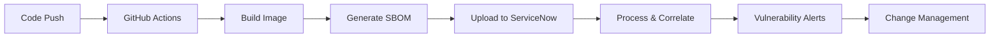

# ServiceNow SBOM Integration

This document describes how Software Bill of Materials (SBOM) documents are automatically generated and uploaded to ServiceNow for vulnerability management and compliance tracking.

## Overview

Every Docker image built by our CI/CD pipeline:
1. **Generates** a CycloneDX SBOM using Anchore SBOM Action
2. **Stores** the SBOM in GitHub artifacts (90-day retention)
3. **Uploads** the SBOM to ServiceNow Vulnerability Response workspace
4. **Links** the SBOM to business applications and lifecycle stages

## Architecture

```
┌─────────────────────────────────────────────────────────────────┐
│ GitHub Actions Workflow (build-images.yaml)                     │
├─────────────────────────────────────────────────────────────────┤
│                                                                  │
│  1. Build Docker Image                                          │
│  2. Scan with Trivy → GitHub Security                          │
│  3. Push to ECR                                                 │
│  4. Generate SBOM (CycloneDX JSON) ┐                           │
│  5. Upload to GitHub Artifacts      │                           │
│  6. Upload to ServiceNow            ├─► ServiceNow Integration  │
│  7. Register Package                │                           │
│                                      │                           │
└──────────────────────────────────────┼───────────────────────────┘
                                       │
                                       ▼
┌─────────────────────────────────────────────────────────────────┐
│ ServiceNow Vulnerability Response                               │
├─────────────────────────────────────────────────────────────────┤
│                                                                  │
│  • SBOM Documents (CycloneDX format)                            │
│  • Vulnerability Correlation                                    │
│  • Package Dependency Tracking                                  │
│  • Business Application Mapping                                 │
│  • Lifecycle Stage Tracking (dev/qa/prod)                       │
│  • Compliance Reporting                                         │
│                                                                  │
└─────────────────────────────────────────────────────────────────┘
```

## Setup Requirements

### 1. ServiceNow Prerequisites

#### Required Plugin
- **Vulnerability Response** application must be installed on your ServiceNow instance
- Navigate to: **System Applications → All Available Applications → All**
- Search for: "Vulnerability Response"
- Click "Install"

#### Required Role
The integration user must have the `sbom_ingest` role:

```
1. Navigate to: User Administration → Users
2. Find user: github_integration (or your integration user)
3. Click on the user record
4. Scroll to "Roles" section
5. Click "Edit"
6. Add role: sbom_ingest
7. Save
```

### 2. GitHub Secrets Configuration

Add these secrets to your GitHub repository:

| Secret Name | Description | Example Value |
|-------------|-------------|---------------|
| `SN_SBOM_USER` | ServiceNow username with `sbom_ingest` role | `github_integration` |
| `SN_SBOM_PASSWORD` | Password for SBOM user | `your-secure-password` |
| `SERVICENOW_INSTANCE_URL` | ServiceNow instance URL | `https://instance.service-now.com` |

**Note:** You can use the same user as other ServiceNow integrations if it has the `sbom_ingest` role, or create a dedicated SBOM user for better separation of concerns.

### 3. Business Application Setup (Optional but Recommended)

For better organization and tracking, create business applications in ServiceNow:

```
1. Navigate to: Business Applications → Create New
2. For each microservice, create:
   - Name: "Online Boutique - {service-name}"
   - Example: "Online Boutique - frontend"
   - Example: "Online Boutique - cartservice"

3. Link to CMDB Configuration Items as needed
```

## How It Works

### Per-Service SBOM Upload

Each of the 12 microservices gets its own SBOM uploaded:

```yaml
# For each service (frontend, cartservice, etc.)
- Generate SBOM: sbom-{service}.json
- Upload to ServiceNow with metadata:
  - businessApplicationName: "Online Boutique - {service}"
  - lifecycleStage: "pre_production" (dev/qa) or "production" (prod)
  - buildId: GitHub run number
  - fetchVulnerabilityInfo: true
  - fetchPackageInfo: true
```

### Lifecycle Stage Mapping

| Environment | ServiceNow Lifecycle Stage |
|-------------|----------------------------|
| `dev` | `pre_production` |
| `qa` | `pre_production` |
| `prod` | `production` |

This allows you to track vulnerabilities across different stages of your deployment pipeline.

### Metadata Included

Each SBOM uploaded to ServiceNow includes:

- **Repository**: Freundcloud/microservices-demo
- **Branch/Tag**: Git ref (e.g., `main`, `release/v1.2.5`)
- **Build ID**: GitHub Actions run number
- **Business Application**: Service-specific (e.g., "Online Boutique - frontend")
- **Lifecycle Stage**: Environment-based (pre_production or production)
- **Vulnerability Info**: Automatically fetched by ServiceNow
- **Package Info**: Full dependency tree with versions

## Viewing SBOMs in ServiceNow

### Navigate to SBOM Workspace

```
ServiceNow → Vulnerability Response → SBOM Workspace → Documents
```

### Filter by Business Application

```
1. Click "Filter" icon
2. Filter by: Business Application = "Online Boutique - frontend"
3. See all SBOMs for that service across all builds
```

### View Vulnerabilities

```
1. Open an SBOM document
2. Navigate to "Vulnerabilities" tab
3. See correlated CVEs with:
   - Severity (Critical, High, Medium, Low)
   - CVSS Score
   - Affected packages
   - Remediation recommendations
```

### Track Across Environments

```
1. Filter by Lifecycle Stage:
   - "pre_production" → dev/qa deployments
   - "production" → prod deployments
2. Compare SBOMs between stages
3. Track vulnerability remediation progress
```

## Benefits

### Security
- ✅ **Centralized vulnerability tracking** across all 12 services
- ✅ **Automatic CVE correlation** with known vulnerabilities
- ✅ **Dependency visibility** - see all packages and versions
- ✅ **Historical tracking** - audit trail of all components

### Compliance
- ✅ **SOC2 compliance** - demonstrable SBOM tracking
- ✅ **Supply chain transparency** - full bill of materials
- ✅ **Audit ready** - historical records with timestamps
- ✅ **Regulatory reporting** - export SBOMs as needed

### Operations
- ✅ **Single pane of glass** - all SBOMs in ServiceNow
- ✅ **Integrated workflows** - link to Change Requests
- ✅ **Risk prioritization** - automatic scoring
- ✅ **Remediation tracking** - see fixes across deployments

## Troubleshooting

### SBOM Upload Fails

**Error**: "HTTP 401: Unauthorized"

**Solution**:
1. Verify `SN_SBOM_USER` secret is correct
2. Check user has `sbom_ingest` role in ServiceNow
3. Verify password in `SN_SBOM_PASSWORD` secret

---

**Error**: "Application not found"

**Solution**:
1. Check Vulnerability Response plugin is installed
2. Verify plugin is activated (not just installed)
3. Contact ServiceNow admin if plugin is missing

---

**Error**: "Business application not found"

**Solution**:
- This is a warning, not a failure
- ServiceNow will auto-create the business application
- Or manually create in ServiceNow: Business Applications → Create New

### No Vulnerabilities Shown

**Issue**: SBOM uploaded but no vulnerabilities displayed

**Solution**:
1. Wait 5-10 minutes for ServiceNow to process
2. Check `fetchVulnerabilityInfo: true` in workflow
3. Verify ServiceNow has access to vulnerability databases
4. Check ServiceNow system logs for processing errors

### Multiple SBOMs for Same Build

**Issue**: Duplicate SBOMs appearing

**Solution**:
- This is normal if workflow retries
- ServiceNow uses `buildId` to track versions
- Latest SBOM for a buildId is the authoritative one

## Validation

### Verify SBOM Upload

After a successful build, check:

```bash
# 1. GitHub Actions Summary
# Look for:
✅ SBOM generated and uploaded to ServiceNow
✅ Business Application: `Online Boutique - {service}`
✅ Lifecycle Stage: `pre_production` or `production`

# 2. ServiceNow
Navigate to: Vulnerability Response → SBOM Workspace → Documents
Filter: Build ID = {GitHub run number}
Expected: 12 SBOM documents (one per service)
```

### Sample SBOM Document

A successful SBOM upload creates a record with:

```
Document ID: SBOM{number}
Name: microservices-demo/sbom-frontend.json
Repository: Freundcloud/microservices-demo
Branch: main
Build ID: 123
Business Application: Online Boutique - frontend
Lifecycle Stage: pre_production
Status: Processed
Vulnerabilities: {count}
Packages: {count}
```

## Workflow Integration

### Automated Process



### Manual Verification

To manually test SBOM upload:

```bash
# Trigger a build
just promote 1.2.6 all

# Or trigger GitHub Actions workflow manually:
# Navigate to: Actions → MASTER-PIPELINE
# Click: "Run workflow"
# Select branch: main
# Environment: dev
# Click: "Run workflow"
```

## Advanced Configuration

### Custom Business Application Names

Edit `.github/workflows/build-images.yaml`:

```yaml
businessApplicationName: 'MyApp - ${{ matrix.service }}'
```

### Skip SBOM Upload for Specific Services

Add condition to the SBOM upload step:

```yaml
- name: Upload SBOM to ServiceNow
  if: inputs.push_images && matrix.service != 'loadgenerator'
  # ... rest of step
```

### Adjust Vulnerability Fetching

Control what ServiceNow fetches:

```yaml
fetchVulnerabilityInfo: false  # Don't auto-fetch vulnerabilities
fetchPackageInfo: false         # Don't fetch package details
```

## Security Considerations

### Credential Management
- ✅ Use dedicated SBOM user (not admin)
- ✅ Rotate passwords regularly (90 days)
- ✅ Use GitHub encrypted secrets
- ✅ Never commit credentials to code

### SBOM Content
- ✅ SBOMs may contain internal package names
- ✅ Consider what's exposed in public repos
- ✅ SBOMs don't contain source code
- ✅ Review SBOM content before sharing externally

### Access Control
- ✅ Restrict `sbom_ingest` role to integration users
- ✅ Use ServiceNow ACLs to control SBOM visibility
- ✅ Audit SBOM access regularly
- ✅ Separate dev/prod ServiceNow instances if needed

## References

- [ServiceNow SBOM GitHub Action](https://github.com/ServiceNow/servicenow-devops-sbom)
- [Anchore SBOM Action](https://github.com/anchore/sbom-action)
- [CycloneDX Specification](https://cyclonedx.org/)
- [ServiceNow Vulnerability Response](https://docs.servicenow.com/bundle/vancouver-security-management/page/product/vulnerability-response/concept/vulnerability-response-landing.html)

## Support

For issues with:
- **SBOM generation**: Check Anchore SBOM action logs
- **GitHub integration**: Review GitHub Actions logs
- **ServiceNow upload**: Check ServiceNow system logs
- **Vulnerability correlation**: Contact ServiceNow support

---

**Last Updated**: 2025-10-28
**Workflow**: `.github/workflows/build-images.yaml`
**Integration Version**: ServiceNow DevOps SBOM v2.0.1
