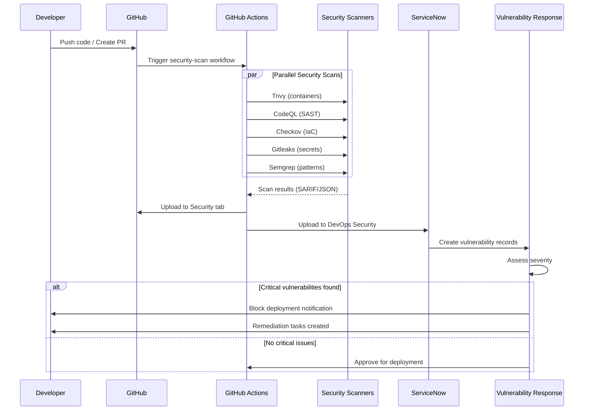
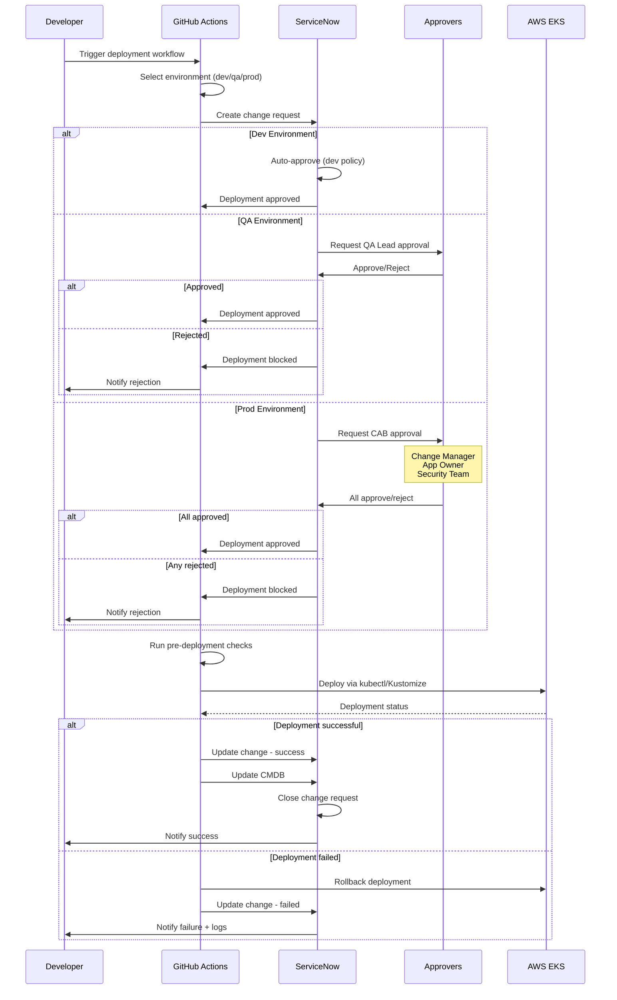
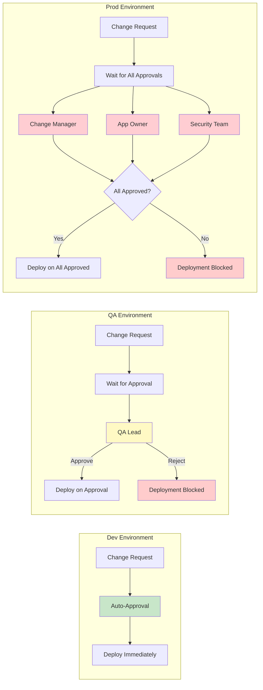
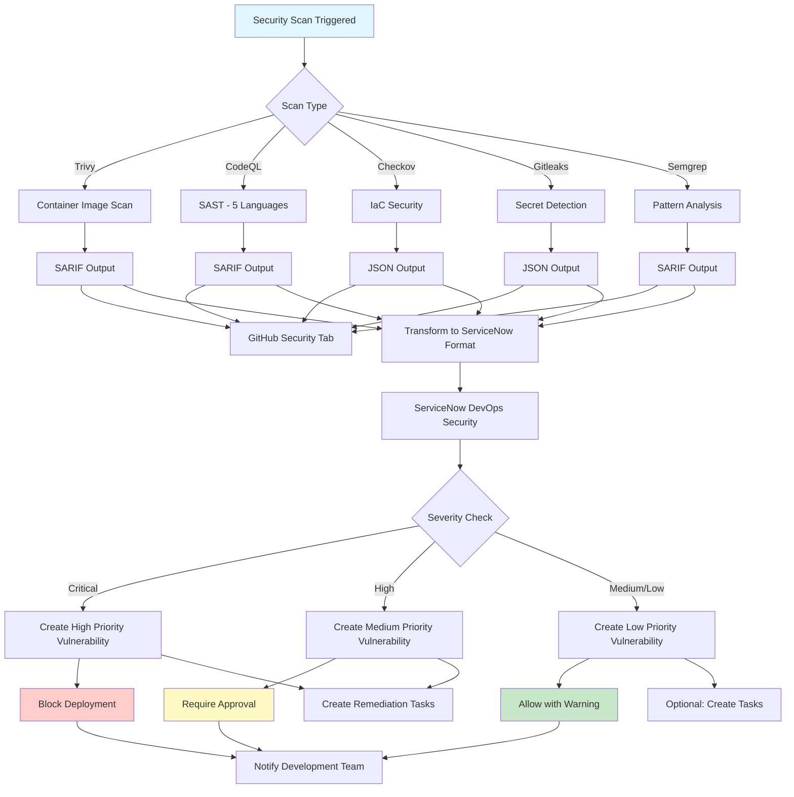
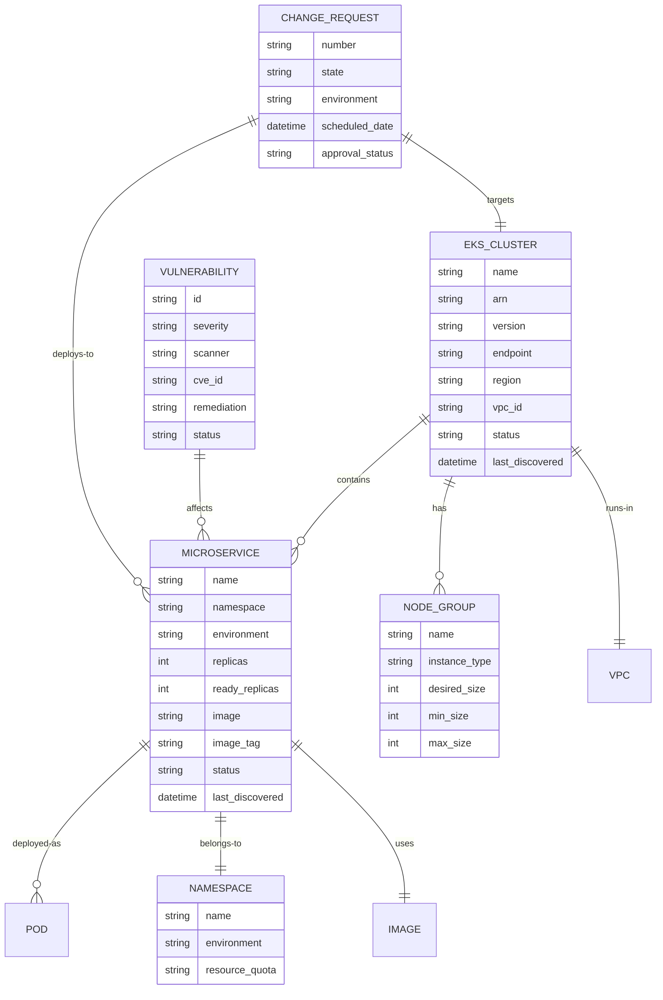
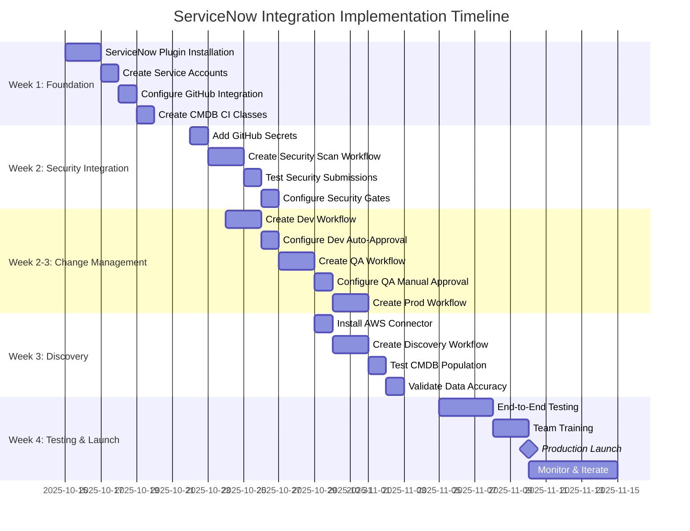

# ServiceNow Integration Architecture

## Overview Diagram

This document provides visual representations of the ServiceNow integration architecture.

## Full Integration Architecture

```mermaid
graph TB
    subgraph "GitHub Repository"
        CODE[Code Changes]
        PR[Pull Request]
        MERGE[Merge to Main]
    end

    subgraph "GitHub Actions Workflows"
        SEC_SCAN[Security Scan<br/>Workflow]
        DEPLOY[Deploy with<br/>ServiceNow Workflow]
        DISCOVERY[EKS Discovery<br/>Workflow]

        subgraph "Security Scanners"
            TRIVY[Trivy<br/>Container Scan]
            CODEQL[CodeQL<br/>SAST]
            CHECKOV[Checkov<br/>IaC Security]
            GITLEAKS[Gitleaks<br/>Secrets]
            SEMGREP[Semgrep<br/>SAST]
        end
    end

    subgraph "ServiceNow Platform"
        subgraph "DevOps Module"
            DEVOPS_SEC[Security Results]
            CHANGE_MGT[Change Management]
            DEPLOY_TRACK[Deployment Tracking]
        end

        subgraph "CMDB"
            EKS_CI[EKS Cluster CI]
            SVC_CI[Microservices CIs]
            REL[Relationships]
        end

        subgraph "Approval Workflows"
            DEV_AUTO[Dev Auto-Approve]
            QA_MANUAL[QA Manual Approve]
            PROD_CAB[Prod CAB Approve]
        end

        subgraph "Vulnerability Response"
            VULN[Vulnerabilities]
            REMEDIATE[Remediation Tasks]
        end
    end

    subgraph "AWS EKS"
        CLUSTER[EKS Cluster<br/>microservices]

        subgraph "Environments"
            DEV_NS[Dev Namespace]
            QA_NS[QA Namespace]
            PROD_NS[Prod Namespace]
        end

        subgraph "Microservices"
            FRONTEND[Frontend]
            CART[Cart Service]
            PRODUCT[Product Catalog]
            CURRENCY[Currency Service]
            PAYMENT[Payment Service]
            SHIPPING[Shipping Service]
            EMAIL[Email Service]
            CHECKOUT[Checkout Service]
            RECOMMEND[Recommendation]
            ADS[Ad Service]
            LOAD[Load Generator]
            ASSISTANT[Shopping Assistant]
        end
    end

    %% Workflow Triggers
    CODE --> PR
    PR --> SEC_SCAN
    MERGE --> DEPLOY
    DEPLOY --> DISCOVERY

    %% Security Scan Flow
    SEC_SCAN --> TRIVY
    SEC_SCAN --> CODEQL
    SEC_SCAN --> CHECKOV
    SEC_SCAN --> GITLEAKS
    SEC_SCAN --> SEMGREP

    TRIVY --> DEVOPS_SEC
    CODEQL --> DEVOPS_SEC
    CHECKOV --> DEVOPS_SEC
    GITLEAKS --> DEVOPS_SEC
    SEMGREP --> DEVOPS_SEC

    DEVOPS_SEC --> VULN
    VULN --> REMEDIATE

    %% Deployment Flow
    DEPLOY --> CHANGE_MGT
    CHANGE_MGT --> DEV_AUTO
    CHANGE_MGT --> QA_MANUAL
    CHANGE_MGT --> PROD_CAB

    DEV_AUTO --> DEV_NS
    QA_MANUAL --> QA_NS
    PROD_CAB --> PROD_NS

    DEV_NS --> FRONTEND
    QA_NS --> FRONTEND
    PROD_NS --> FRONTEND

    %% Discovery Flow
    DISCOVERY --> CLUSTER
    CLUSTER --> EKS_CI
    DEV_NS --> SVC_CI
    QA_NS --> SVC_CI
    PROD_NS --> SVC_CI
    EKS_CI --> REL
    SVC_CI --> REL

    %% Tracking
    DEV_NS --> DEPLOY_TRACK
    QA_NS --> DEPLOY_TRACK
    PROD_NS --> DEPLOY_TRACK

    style CODE fill:#e1f5ff
    style PR fill:#e1f5ff
    style MERGE fill:#e1f5ff

    style SEC_SCAN fill:#fff4e6
    style DEPLOY fill:#fff4e6
    style DISCOVERY fill:#fff4e6

    style TRIVY fill:#ffe6e6
    style CODEQL fill:#ffe6e6
    style CHECKOV fill:#ffe6e6
    style GITLEAKS fill:#ffe6e6
    style SEMGREP fill:#ffe6e6

    style DEVOPS_SEC fill:#e8f5e9
    style CHANGE_MGT fill:#e8f5e9
    style DEPLOY_TRACK fill:#e8f5e9

    style EKS_CI fill:#f3e5f5
    style SVC_CI fill:#f3e5f5
    style REL fill:#f3e5f5

    style DEV_AUTO fill:#c8e6c9
    style QA_MANUAL fill:#fff9c4
    style PROD_CAB fill:#ffcdd2

    style CLUSTER fill:#e3f2fd
    style DEV_NS fill:#e3f2fd
    style QA_NS fill:#e3f2fd
    style PROD_NS fill:#e3f2fd
```

## Security Scan Flow

## Change Management Flow

## EKS Discovery Flow

```mermaid
sequenceDiagram
    participant Schedule as Scheduled Trigger
    participant GHA as GitHub Actions
    participant AWS as AWS APIs
    participant K8s as Kubernetes API
    participant SN as ServiceNow CMDB

    Schedule->>GHA: Every 6 hours (or manual)
    GHA->>AWS: Describe EKS cluster
    AWS-->>GHA: Cluster metadata

    GHA->>GHA: Extract cluster info
    Note over GHA: Name, Version, ARN<br/>Endpoint, VPC, Status

    GHA->>K8s: List namespaces
    K8s-->>GHA: dev, qa, prod namespaces

    loop For each namespace
        GHA->>K8s: Get deployments
        K8s-->>GHA: Deployment details
        GHA->>GHA: Extract service info
        Note over GHA: Name, Replicas, Image<br/>Status, Labels
    end

    GHA->>SN: Check if cluster exists
    alt Cluster exists
        GHA->>SN: Update cluster CI
    else New cluster
        GHA->>SN: Create cluster CI
    end

    loop For each microservice
        GHA->>SN: Check if service exists
        alt Service exists
            GHA->>SN: Update service CI
        else New service
            GHA->>SN: Create service CI
        end
    end

    GHA->>SN: Update relationships
    Note over SN: Link services to cluster<br/>Link to change requests

    SN-->>GHA: CMDB updated successfully
    GHA->>GHA: Generate discovery report
```

## Environment-Specific Approval Matrix

## Data Flow: Security Scan Results

## CMDB Structure

## Timeline: 4-Week Implementation

## Component Interaction Matrix

| Component | GitHub Actions | ServiceNow | AWS EKS | Purpose |
|-----------|---------------|------------|---------|---------|
| **Security Scanners** | ✅ Runs | ✅ Receives | ❌ | Vulnerability detection |
| **Change Requests** | ✅ Creates | ✅ Manages | ❌ | Approval workflow |
| **Deployment** | ✅ Executes | ✅ Tracks | ✅ Receives | Application deployment |
| **CMDB Discovery** | ✅ Discovers | ✅ Stores | ✅ Scans | Infrastructure inventory |
| **Approval Workflows** | ✅ Waits | ✅ Processes | ❌ | Governance |
| **Rollback** | ✅ Triggers | ✅ Updates | ✅ Executes | Failure recovery |

## Legend

- 🔵 GitHub Components
- 🟢 ServiceNow Components
- 🔷 AWS Components
- 🔴 Security Components
- 🟡 Approval Components
- ⚠️ Critical Path
- ✅ Success Flow
- ❌ Failure/Block Flow

---

**Note**: All diagrams are written in Mermaid syntax and can be rendered in:
- GitHub Markdown (native support)
- VS Code with Mermaid extension
- Mermaid Live Editor (https://mermaid.live)
