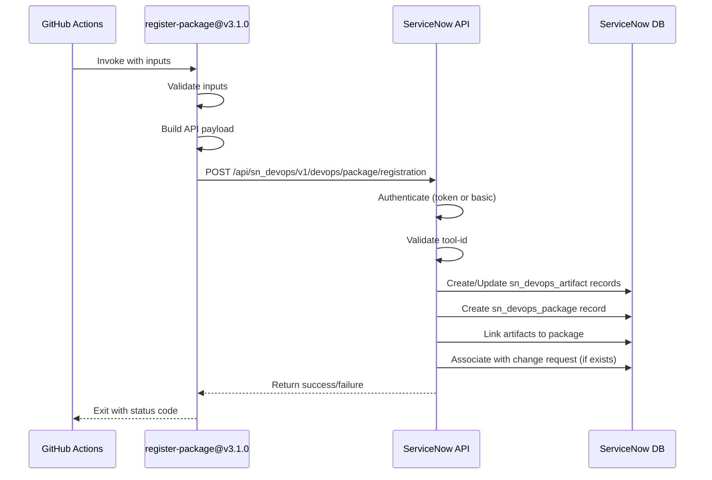
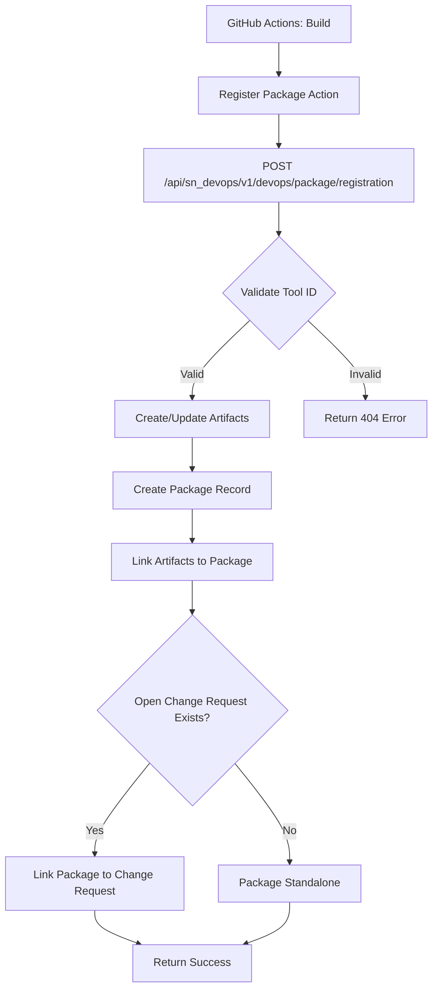

# ServiceNow Package Registration - Deep Dive & Implementation Guide

> **Last Updated**: 2025-01-28
> **Action Version**: v3.1.0
> **Purpose**: Comprehensive technical analysis of ServiceNow package/artifact registration

## Table of Contents

- [Executive Summary](#executive-summary)
- [What We're Uploading](#what-were-uploading)
- [How It Works Internally](#how-it-works-internally)
- [Implementation Details](#implementation-details)
- [Best Practices from ServiceNow](#best-practices-from-servicenow)
- [Data Model & Architecture](#data-model--architecture)
- [Current Implementation Analysis](#current-implementation-analysis)
- [Troubleshooting Guide](#troubleshooting-guide)
- [Future Improvements](#future-improvements)

---

## Executive Summary

### What Is Package Registration?

ServiceNow DevOps **Package Registration** is the process of recording deployable artifacts (Docker images, binaries, JARs) in ServiceNow's artifact management system. This enables:

- 🔗 **Change Management Integration**: Link deployments to change requests
- 📊 **Deployment Tracking**: Monitor what's deployed where
- 📝 **Audit Trail**: Complete history for compliance
- 🔄 **Release Management**: Group artifacts into packages
- 🛡️ **Security**: Track vulnerabilities and dependencies

### Our Implementation

We use **dual registration strategy**:

1. **Per-Service** (`build-images.yaml`): Each of 12 services registered individually during build
2. **Aggregate** (`MASTER-PIPELINE.yaml`): All services grouped into single deployable package

**Action Used**: `ServiceNow/servicenow-devops-register-package@v3.1.0` (standardized across both)

### Key Findings from Research

✅ **Authentication**: Supports both token-based (v3.1.0+) and basic auth
✅ **API Endpoint**: `/api/sn_devops/v1/devops/package/registration`
✅ **Tables**: `sn_devops_artifact`, `sn_devops_package`
✅ **Auto-Linking**: Automatically associates with change requests via tool-id
✅ **Best Practice**: Use semantic versioning + immutability + metadata enrichment

---

## What We're Uploading

### Artifact Structure

Each artifact represents a **single deployable component**:

```json
{
  "name": "533267307120.dkr.ecr.eu-west-2.amazonaws.com/frontend",
  "version": "dev-abc123def456",
  "semanticVersion": "dev-12345",
  "repositoryName": "Freundcloud/microservices-demo"
}
```

**Field Analysis**:

| Field | Value | Purpose | ServiceNow Usage |
|-------|-------|---------|------------------|
| `name` | Full ECR image URL | Unique identifier | Primary key for artifact lookup |
| `version` | `{env}-{commit-sha}` | Exact source code state | Traceability to specific commit |
| `semanticVersion` | `{env}-{run-number}` | Human-readable version | UI display, sorting |
| `repositoryName` | GitHub repo | Source code location | Link to source repository |

### Package Structure

A **package** is a collection of related artifacts:

```yaml
package-name: 'microservices-dev-12345.package'
artifacts: [
  {
    name: "533267307120.dkr.ecr.eu-west-2.amazonaws.com/frontend",
    version: "dev-abc123def456",
    semanticVersion: "dev-12345",
    repositoryName: "Freundcloud/microservices-demo"
  },
  {
    name: "533267307120.dkr.ecr.eu-west-2.amazonaws.com/cartservice",
    version: "dev-abc123def456",
    semanticVersion: "dev-12345",
    repositoryName: "Freundcloud/microservices-demo"
  },
  # ... 10 more services
]
```

**Package Purpose**:
- Groups all 12 microservices for coordinated deployment
- Associates with change requests
- Enables atomic rollback
- Tracks deployment as single unit

---

## How It Works Internally

### GitHub Action Architecture

**Action**: `ServiceNow/servicenow-devops-register-package@v3.1.0`

**Runtime Environment**:
- Node.js 20
- Entry point: `dist/index.js` (compiled TypeScript)
- Execution: GitHub Actions runner

**Source**: https://github.com/ServiceNow/servicenow-devops-register-package

### Internal Workflow



### API Request Details

**Endpoint**: `POST {instance-url}/api/sn_devops/v1/devops/package/registration`

**Authentication Headers**:

Option 1 - Token Auth (Recommended):
```http
POST /api/sn_devops/v1/devops/package/registration HTTP/1.1
Host: calitiiltddemo3.service-now.com
Authorization: Bearer {SN_DEVOPS_INTEGRATION_TOKEN}
Content-Type: application/json
```

Option 2 - Basic Auth (Current):
```http
POST /api/sn_devops/v1/devops/package/registration HTTP/1.1
Host: calitiiltddemo3.service-now.com
Authorization: Basic base64(username:password)
Content-Type: application/json
```

**Request Payload** (inferred from Jenkins plugin docs):
```json
{
  "tool_id": "f62c4e49c3fcf614e1bbf0cb050131ef",
  "name": "microservices-dev-12345.package",
  "artifacts": [
    {
      "name": "533267307120.dkr.ecr.eu-west-2.amazonaws.com/frontend",
      "version": "dev-abc123def456",
      "semanticVersion": "dev-12345",
      "repositoryName": "Freundcloud/microservices-demo"
    }
  ],
  "context": {
    "workflow": "MASTER-PIPELINE",
    "job": "Register Packages - dev",
    "run_number": 12345,
    "run_id": 98765,
    "actor": "olafkfreund",
    "sha": "abc123def456789",
    "ref": "refs/heads/main",
    "event_name": "push",
    "repository": "Freundcloud/microservices-demo"
  }
}
```

**Response** (success):
```json
{
  "result": {
    "package_id": "a1b2c3d4e5f6g7h8i9j0k1l2m3n4o5p6",
    "package_name": "microservices-dev-12345.package",
    "artifacts_registered": 12,
    "status": "success"
  }
}
```

**Response** (error):
```json
{
  "error": {
    "message": "Invalid tool_id",
    "detail": "Tool with sys_id f62c4e49... not found",
    "status": "404"
  }
}
```

### ServiceNow Processing

1. **Authentication**:
   - Validates token or basic auth credentials
   - Checks user has `sn_devops.devops_integration_user` role

2. **Tool Validation**:
   - Looks up `tool_id` in `sn_devops_tool` table
   - Verifies tool is active and type is "GitHub"
   - Retrieves tool configuration

3. **Artifact Registration**:
   - For each artifact in payload:
     - Check if artifact exists (by name + version)
     - If exists: Update last_registered timestamp
     - If new: Create new record in `sn_devops_artifact`
     - Store: name, version, semanticVersion, repository, tool reference

4. **Package Creation**:
   - Create record in `sn_devops_package` table
   - Store package name, tool reference, timestamp
   - Link all artifacts to package via many-to-many table

5. **Change Request Association** (automatic):
   - Query for open change requests with matching tool_id
   - Find change request created in same workflow run
   - Link package to change request via `m2m_change_package` table

6. **Response**:
   - Return package sys_id and summary
   - Log success/failure in ServiceNow system logs

---

## Implementation Details

### Per-Service Registration (build-images.yaml)

**Location**: `.github/workflows/build-images.yaml` lines 491-503

**Trigger**: After each service's Docker image is pushed to ECR

**Code**:
```yaml
- name: Register Package with ServiceNow
  if: inputs.push_images
  uses: ServiceNow/servicenow-devops-register-package@v3.1.0
  with:
    devops-integration-user-name: ${{ secrets.SERVICENOW_USERNAME }}
    devops-integration-user-password: ${{ secrets.SERVICENOW_PASSWORD }}
    instance-url: ${{ secrets.SERVICENOW_INSTANCE_URL }}
    tool-id: ${{ secrets.SN_ORCHESTRATION_TOOL_ID }}
    context-github: ${{ toJSON(github) }}
    job-name: 'Build ${{ matrix.service }}'
    artifacts: '[{"name": "${{ env.ECR_REGISTRY }}/${{ matrix.service }}", "version": "${{ inputs.environment }}-${{ github.sha }}", "semanticVersion": "${{ inputs.environment }}-${{ github.run_number }}", "repositoryName": "${{ github.repository }}"}]'
    package-name: '${{ matrix.service }}-${{ inputs.environment }}-${{ github.run_number }}.package'
  continue-on-error: true
```

**Key Points**:
- ✅ `continue-on-error: true` - Build succeeds even if registration fails
- ✅ Matrix strategy: Runs for each of 12 services independently
- ✅ Single artifact per package (one service)
- ✅ Package name: `{service}-{env}-{run}.package` (e.g., `frontend-dev-12345.package`)

**Result in ServiceNow**:
```
sn_devops_package: frontend-dev-12345.package
  └── sn_devops_artifact: 533267307120.dkr.ecr.eu-west-2.amazonaws.com/frontend:dev-abc123

sn_devops_package: cartservice-dev-12345.package
  └── sn_devops_artifact: 533267307120.dkr.ecr.eu-west-2.amazonaws.com/cartservice:dev-abc123

... (10 more)
```

### Aggregate Registration (MASTER-PIPELINE.yaml)

**Location**: `.github/workflows/MASTER-PIPELINE.yaml` lines 360-419

**Trigger**: After all builds complete, before deployment

**Code**:
```yaml
register-packages:
  name: "📦 Register Packages in ServiceNow"
  needs: [pipeline-init, build-and-push]
  if: |
    needs.build-and-push.result == 'success' &&
    github.event_name != 'pull_request'
  runs-on: ubuntu-latest

  steps:
    - name: Checkout Code
      uses: actions/checkout@v4

    - name: Build Package Metadata
      id: package-metadata
      run: |
        # Extract services that were built
        SERVICES="${{ needs.build-and-push.outputs.services_built }}"

        # Build artifacts JSON for ServiceNow
        ARTIFACTS='[]'
        if [ -n "$SERVICES" ] && [ "$SERVICES" != "null" ]; then
          for service in $(echo "$SERVICES" | jq -r '.[]' 2>/dev/null || echo ""); do
            ARTIFACT=$(jq -n \
              --arg name "${{ secrets.AWS_ACCOUNT_ID }}.dkr.ecr.eu-west-2.amazonaws.com/${service}" \
              --arg version "${{ needs.pipeline-init.outputs.environment }}-${{ github.sha }}" \
              --arg semantic "${{ needs.pipeline-init.outputs.environment }}-${{ github.run_number }}" \
              --arg repo "${{ github.repository }}" \
              '{
                "name": $name,
                "version": $version,
                "semanticVersion": $semantic,
                "repositoryName": $repo
              }')
            ARTIFACTS=$(echo "$ARTIFACTS" | jq ". += [$ARTIFACT]")
          done
        fi

        echo "artifacts=$ARTIFACTS" >> $GITHUB_OUTPUT

    - name: Register Docker Images
      if: steps.package-metadata.outputs.artifacts != '[]'
      uses: ServiceNow/servicenow-devops-register-package@v3.1.0
      with:
        devops-integration-user-name: ${{ secrets.SERVICENOW_USERNAME }}
        devops-integration-user-password: ${{ secrets.SERVICENOW_PASSWORD }}
        instance-url: ${{ secrets.SERVICENOW_INSTANCE_URL }}
        tool-id: ${{ secrets.SN_ORCHESTRATION_TOOL_ID }}
        context-github: ${{ toJSON(github) }}
        job-name: 'Register Packages - ${{ needs.pipeline-init.outputs.environment }}'
        artifacts: ${{ steps.package-metadata.outputs.artifacts }}
        package-name: 'microservices-${{ needs.pipeline-init.outputs.environment }}-${{ github.run_number }}.package'
```

**Key Points**:
- ✅ Collects all successfully built services from `build-and-push` job output
- ✅ Builds JSON array with all 12 artifacts
- ✅ Single package containing all services
- ✅ Package name: `microservices-{env}-{run}.package` (e.g., `microservices-dev-12345.package`)
- ⚠️ No `continue-on-error` - will fail pipeline if registration fails

**Result in ServiceNow**:
```
sn_devops_package: microservices-dev-12345.package
  ├── sn_devops_artifact: ECR/frontend:dev-abc123
  ├── sn_devops_artifact: ECR/cartservice:dev-abc123
  ├── sn_devops_artifact: ECR/productcatalogservice:dev-abc123
  ├── sn_devops_artifact: ECR/currencyservice:dev-abc123
  ├── sn_devops_artifact: ECR/paymentservice:dev-abc123
  ├── sn_devops_artifact: ECR/shippingservice:dev-abc123
  ├── sn_devops_artifact: ECR/emailservice:dev-abc123
  ├── sn_devops_artifact: ECR/checkoutservice:dev-abc123
  ├── sn_devops_artifact: ECR/recommendationservice:dev-abc123
  ├── sn_devops_artifact: ECR/adservice:dev-abc123
  ├── sn_devops_artifact: ECR/loadgenerator:dev-abc123
  └── sn_devops_artifact: ECR/shoppingassistantservice:dev-abc123
```

### Why Dual Registration?

| Aspect | Per-Service | Aggregate | Winner |
|--------|-------------|-----------|--------|
| **Granularity** | Fine-grained tracking | Holistic view | Both needed |
| **Timing** | Immediate (during build) | After all builds | Per-service faster |
| **Use Case** | Individual service audit | Deployment tracking | Different purposes |
| **Change Linking** | No (too granular) | Yes (deployment-level) | Aggregate |
| **Rollback** | Per-service rollback | Coordinated rollback | Aggregate |
| **Overhead** | 12 API calls | 1 API call | Aggregate efficient |

**Conclusion**: Both registrations serve different purposes and complement each other.

---

## Best Practices from ServiceNow

### 1. Artifact Versioning

**Source**: Jenkins Plugin Docs, Azure DevOps Docs

**Recommendation**: Use semantic versioning (MAJOR.MINOR.PATCH)

**Our Implementation**:
```yaml
version: "${{ inputs.environment }}-${{ github.sha }}"
semanticVersion: "${{ inputs.environment }}-${{ github.run_number }}"
```

**Analysis**:
- ✅ **Good**: Immutable (includes commit SHA)
- ✅ **Good**: Environment-aware (prevents collisions)
- ⚠️ **Improvement**: Not true semantic versioning for production

**Recommendation for Production**:
```yaml
# For prod deployments, use git tags
version: "${{ github.ref_name }}"  # v1.2.3
semanticVersion: "${{ github.ref_name }}"  # v1.2.3

# For dev/qa, keep current approach
version: "${{ inputs.environment }}-${{ github.sha }}"
semanticVersion: "${{ inputs.environment }}-${{ github.run_number }}"
```

### 2. Immutability

**Best Practice**: Once registered, never modify artifact/package records

**Our Implementation**: ✅ Compliant
- Each build creates new version (commit SHA changes)
- Never reuse version numbers
- ECR images are immutable (can't overwrite tags)

**Enforcement**:
```yaml
# Good ✅
- version: "dev-abc123"  # Unique commit SHA
- semanticVersion: "dev-12345"  # Unique run number

# Bad ❌
- version: "dev-latest"  # Mutable tag
- semanticVersion: "dev"  # Reused across builds
```

### 3. Metadata Enrichment

**Best Practice**: Include rich metadata for traceability

**Source**: DevOps artifact versioning best practices

**Current Implementation**: ⚠️ Minimal
```json
{
  "name": "...",
  "version": "...",
  "semanticVersion": "...",
  "repositoryName": "..."
}
```

**Recommended Enhancement**:
```json
{
  "name": "ECR/frontend",
  "version": "dev-abc123",
  "semanticVersion": "dev-12345",
  "repositoryName": "Freundcloud/microservices-demo",
  "buildDate": "2025-01-28T10:30:00Z",
  "builderId": "github-actions",
  "commitHash": "abc123def456789",
  "commitMessage": "feat: Add shopping cart",
  "author": "olafkfreund",
  "branch": "main",
  "pullRequest": "123",
  "vulnerabilities": "0 critical, 2 high, 5 medium",
  "sbomGenerated": true,
  "testsPassed": true,
  "testCoverage": "87%",
  "dockerImageDigest": "sha256:abcd1234..."
}
```

**Implementation**: Action doesn't support additional fields directly, but could be added to package name or stored separately.

### 4. Package Naming Convention

**Best Practice**: Consistent, sortable, descriptive names

**Our Implementation**: ✅ Good
```
microservices-{environment}-{run-number}.package
frontend-{environment}-{run-number}.package
```

**Why It Works**:
- ✅ Environment-specific
- ✅ Sortable chronologically
- ✅ Human-readable
- ✅ Unique per build

### 5. Change Request Integration

**Best Practice**: Automatically associate packages with change requests

**Source**: ServiceNow DevOps Change Velocity docs

**Our Implementation**: ✅ Automatic
- Change request created first (`servicenow-change-rest.yaml`)
- Packages registered second (`register-packages` job)
- ServiceNow auto-links via same `tool-id` and workflow context

**Workflow Order** (critical):
```yaml
servicenow-change:
  name: "📝 ServiceNow Change Request"
  # Creates change request

register-packages:
  name: "📦 Register Packages in ServiceNow"
  needs: [servicenow-change]  # ← Must run AFTER change creation
  # Registers packages (auto-linked to change)

deploy-to-environment:
  name: "🚀 Deploy to Environment"
  needs: [register-packages]  # ← Deployment happens AFTER registration
  # Deploys packages
```

### 6. Error Handling

**Best Practice**: Gracefully handle registration failures

**Current Implementation**: Mixed
- ✅ Per-service: `continue-on-error: true` (good)
- ❌ Aggregate: No error handling (will fail pipeline)

**Recommendation**:
```yaml
- name: Register Docker Images
  id: register-packages
  continue-on-error: true  # ← Add this
  uses: ServiceNow/servicenow-devops-register-package@v3.1.0
  # ...

- name: Check Registration Status
  run: |
    if [ "${{ steps.register-packages.outcome }}" == "failure" ]; then
      echo "::warning::Package registration failed - deployment tracking may be incomplete"
      echo "⚠️ ServiceNow registration failed but deployment will proceed" >> $GITHUB_STEP_SUMMARY
    else
      echo "✅ Package successfully registered in ServiceNow" >> $GITHUB_STEP_SUMMARY
    fi
```

### 7. Branch and Build Metadata

**Best Practice**: Include branch name in registration context

**Source**: Jenkins plugin example

**Current Implementation**: ✅ Automatic via `context-github: ${{ toJSON(github) }}`

The GitHub context includes:
```json
{
  "ref": "refs/heads/main",
  "sha": "abc123def456",
  "workflow": "MASTER-PIPELINE",
  "run_number": 12345,
  "run_id": 98765,
  "actor": "olafkfreund",
  "event_name": "push",
  "repository": "Freundcloud/microservices-demo"
}
```

ServiceNow stores this context for traceability.

---

## Data Model & Architecture

### ServiceNow Tables

#### 1. sn_devops_tool

Stores integration tool configurations (GitHub, Jenkins, etc.)

**Key Fields**:
```
sys_id: f62c4e49c3fcf614e1bbf0cb050131ef
name: GitHub - Freundcloud/microservices-demo
type: GitHub
url: https://github.com/Freundcloud/microservices-demo
active: true
created_by: admin
created_on: 2025-01-15 10:00:00
```

#### 2. sn_devops_artifact

Stores individual artifact metadata.

**Schema**:
| Field | Type | Description | Example |
|-------|------|-------------|---------|
| sys_id | String (32) | Unique ID | a1b2c3d4... |
| name | String (255) | Artifact name | ECR/frontend |
| version | String (100) | Build version | dev-abc123 |
| semantic_version | String (100) | Display version | dev-12345 |
| artifact_tool | Reference | Tool sys_id | f62c4e49... |
| repository | String (255) | Source repo | Freundcloud/microservices-demo |
| created_on | DateTime | Registration time | 2025-01-28 10:30:15 |
| created_by | String (40) | Integration user | github_integration |

**Example Record**:
```
sys_id: a1b2c3d4e5f6g7h8i9j0k1l2m3n4o5p6
name: 533267307120.dkr.ecr.eu-west-2.amazonaws.com/frontend
version: dev-abc123def456
semantic_version: dev-12345
artifact_tool: f62c4e49c3fcf614e1bbf0cb050131ef
repository: Freundcloud/microservices-demo
created_on: 2025-01-28 10:30:15
created_by: github_integration
```

#### 3. sn_devops_package

Stores package collections.

**Schema**:
| Field | Type | Description | Example |
|-------|------|-------------|---------|
| sys_id | String (32) | Unique ID | q1w2e3r4... |
| name | String (255) | Package name | microservices-dev-12345.package |
| artifact_tool | Reference | Tool sys_id | f62c4e49... |
| created_on | DateTime | Registration time | 2025-01-28 10:32:00 |
| created_by | String (40) | Integration user | github_integration |

**Related Lists**:
- `artifacts` - Many-to-many to `sn_devops_artifact` via `m2m_package_artifact`
- `change_requests` - Many-to-many to `change_request` via `m2m_change_package`

**Example Record**:
```
sys_id: q1w2e3r4t5y6u7i8o9p0a1s2d3f4g5h6
name: microservices-dev-12345.package
artifact_tool: f62c4e49c3fcf614e1bbf0cb050131ef
created_on: 2025-01-28 10:32:00
created_by: github_integration
artifacts: [12 linked records]
change_requests: [CHG0123456]
```

#### 4. m2m_package_artifact

Many-to-many linking table between packages and artifacts.

**Schema**:
| Field | Type | Description |
|-------|------|-------------|
| package | Reference | sn_devops_package.sys_id |
| artifact | Reference | sn_devops_artifact.sys_id |

**Example Records**:
```
package: q1w2e3r4... (microservices-dev-12345.package)
artifact: a1b2c3d4... (frontend:dev-abc123)

package: q1w2e3r4... (microservices-dev-12345.package)
artifact: z9y8x7w6... (cartservice:dev-abc123)

... (10 more)
```

#### 5. m2m_change_package

Many-to-many linking table between change requests and packages.

**Schema**:
| Field | Type | Description |
|-------|------|-------------|
| change_request | Reference | change_request.sys_id |
| package | Reference | sn_devops_package.sys_id |

**Example Record**:
```
change_request: c1h2g3... (CHG0123456)
package: q1w2e3r4... (microservices-dev-12345.package)
```

### Entity Relationship Diagram

```
┌─────────────────────┐
│  sn_devops_tool     │
│  (GitHub Tool)      │
│  sys_id: f62c4e...  │
└──────────┬──────────┘
           │
           │ (tool reference)
           │
           ├─────────────────────────────────┐
           │                                 │
           ▼                                 ▼
┌─────────────────────┐          ┌─────────────────────┐
│  sn_devops_artifact │          │  sn_devops_package  │
│  (Frontend Image)   │          │  (Deployment Pkg)   │
│  sys_id: a1b2c3...  │◄─────────┤  sys_id: q1w2e3...  │
│  name: ECR/frontend │  m2m_    │  name: microserv... │
│  version: dev-abc.. │  package_│  12 artifacts       │
└─────────────────────┘  artifact└──────────┬──────────┘
                                            │
                                            │ m2m_change_package
                                            │
                                            ▼
                                 ┌─────────────────────┐
                                 │  change_request     │
                                 │  (Change CHG012..)  │
                                 │  sys_id: c1h2g3...  │
                                 │  state: Implement   │
                                 └─────────────────────┘
```

### Data Flow



---

## Current Implementation Analysis

### Secrets Configuration

**Required Secrets** in GitHub:

| Secret | Purpose | Current Value (Redacted) |
|--------|---------|--------------------------|
| `SERVICENOW_USERNAME` | Integration user | `github_integration` |
| `SERVICENOW_PASSWORD` | User password | `oA3KqdUVI8Q_^>` |
| `SERVICENOW_INSTANCE_URL` | Instance URL | `https://calitiiltddemo3.service-now.com` |
| `SN_ORCHESTRATION_TOOL_ID` | GitHub tool ID | `f62c4e49c3fcf614e1bbf0cb050131ef` |

**Security Considerations**:
- ✅ Secrets stored in GitHub (encrypted at rest)
- ⚠️ Basic auth (password rotation required)
- 🔄 Consider migrating to token auth (more secure)

### Pipeline Integration

**Complete Flow**:

```
1. pipeline-init
   ↓
2. build-and-push (matrix: 12 services)
   ├─ Build frontend
   │  ├─ Push to ECR
   │  ├─ Generate SBOM
   │  ├─ Upload SBOM to ServiceNow
   │  └─ Register Package (Per-Service) ← Package Registration #1
   ├─ Build cartservice
   │  └─ Register Package (Per-Service) ← Package Registration #2
   └─ ... (10 more)
       └─ Register Package (Per-Service) ← Package Registration #12
   ↓
3. upload-test-results
   ↓
4. register-packages
   └─ Register Docker Images (Aggregate) ← Package Registration #13 (all services)
   ↓
5. servicenow-change
   └─ Create Change Request (auto-links to package from step 4)
   ↓
6. deploy-to-environment
   ↓
7. smoke-tests
   ↓
8. create-github-release (prod only)
```

**Key Dependencies**:
- `register-packages` MUST run before `servicenow-change` for auto-linking
- `servicenow-change` MUST complete before `deploy-to-environment`
- Per-service registration is independent (can fail without blocking)

### Performance Impact

**API Calls Per Build**:
- Per-service: 12 API calls (one per service)
- Aggregate: 1 API call
- **Total**: 13 API calls to ServiceNow

**Timing**:
- Per-service: ~2-3 seconds per registration (parallel execution)
- Aggregate: ~3-5 seconds
- **Total overhead**: ~5-8 seconds per pipeline run

**Optimization Opportunities**:
- ✅ Already parallel (per-service runs in matrix)
- ⚠️ Could skip per-service and only do aggregate (reduce to 1 call)
- ⚠️ Could batch artifacts in single API call (not supported by action currently)

---

## Troubleshooting Guide

### Issue 1: Package Registration Fails - Authentication Error

**Symptom**:
```
Error: Package registration failed
Error: 401 Unauthorized
```

**Root Causes**:
1. Invalid ServiceNow credentials
2. Password expired
3. User account disabled
4. Insufficient permissions

**Diagnosis**:
```bash
# Test credentials manually
curl -u "$SERVICENOW_USERNAME:$SERVICENOW_PASSWORD" \
  "$SERVICENOW_INSTANCE_URL/api/now/table/sys_user?sysparm_limit=1"

# Expected: HTTP 200 with user data
# If 401: Credentials invalid
```

**Solution**:
1. Verify credentials in ServiceNow UI
2. Check user has `sn_devops.devops_integration_user` role
3. Update GitHub secrets if credentials changed
4. Consider migrating to token auth (more reliable)

### Issue 2: Invalid Tool ID

**Symptom**:
```
Error: Tool with sys_id f62c4e49... not found
```

**Root Causes**:
1. Tool ID incorrect in GitHub secrets
2. Tool deleted from ServiceNow
3. Tool inactive

**Diagnosis**:
```bash
# Check if tool exists
curl -u "$SERVICENOW_USERNAME:$SERVICENOW_PASSWORD" \
  "$SERVICENOW_INSTANCE_URL/api/now/table/sn_devops_tool/$SN_ORCHESTRATION_TOOL_ID"

# Expected: HTTP 200 with tool details
# If 404: Tool not found
```

**Solution**:
1. Navigate to ServiceNow: **DevOps → Tools → GitHub Tools**
2. Find your GitHub integration tool
3. Copy sys_id from URL: `.../sn_devops_tool.do?sys_id=**f62c4e49...**`
4. Update `SN_ORCHESTRATION_TOOL_ID` secret in GitHub

### Issue 3: Artifacts Not Linked to Change Request

**Symptom**: Package registered successfully but doesn't appear in change request

**Root Causes**:
1. Package registered BEFORE change request created
2. Different tool-id used
3. Change request already closed
4. Workflow context mismatch

**Diagnosis**:
```bash
# Check workflow order
grep -A 5 "needs:" .github/workflows/MASTER-PIPELINE.yaml | grep -E "(servicenow-change|register-packages)"

# Should show: register-packages runs AFTER servicenow-change
```

**Solution**:
1. Ensure correct job order:
   ```yaml
   servicenow-change:
     name: "📝 ServiceNow Change Request"
     needs: [register-packages]  # ← Package registration FIRST
   ```

2. Verify same tool-id used in both actions

3. Check change request state (must be open, not closed)

### Issue 4: Duplicate Package Names

**Symptom**:
```
Error: Package microservices-dev-12345.package already exists
```

**Root Cause**: Rerunning workflow with same run number

**Solution**: Use unique identifiers:
```yaml
# Current (good) ✅
package-name: 'microservices-${{ inputs.environment }}-${{ github.run_number }}.package'

# Alternative: Add timestamp
package-name: 'microservices-${{ inputs.environment }}-${{ github.run_number }}-${{ github.run_attempt }}.package'
```

### Issue 5: JSON Parsing Errors

**Symptom**:
```
Error: Invalid artifacts JSON: Unexpected token at position 45
```

**Root Cause**: Malformed JSON in artifacts parameter

**Diagnosis**:
```bash
# Test JSON validity
echo '${{ steps.package-metadata.outputs.artifacts }}' | jq .

# If error: JSON is malformed
```

**Solution**:
```yaml
# Debug step
- name: Debug Artifacts JSON
  run: |
    echo "Raw artifacts:"
    echo "${{ steps.package-metadata.outputs.artifacts }}"
    echo ""
    echo "Parsed artifacts:"
    echo "${{ steps.package-metadata.outputs.artifacts }}" | jq .
```

### Issue 6: Missing Services in Package

**Symptom**: Aggregate package only has 8 services instead of 12

**Root Cause**: Some services failed to build, so not included in `services_built` output

**Diagnosis**:
```yaml
- name: Debug Services Built
  run: |
    echo "Services built: ${{ needs.build-and-push.outputs.services_built }}"
    echo "Count: $(echo '${{ needs.build-and-push.outputs.services_built }}' | jq 'length')"
```

**Solution**:
1. Check build-and-push job for failures
2. Fix failing service builds
3. Re-run pipeline

---

## Future Improvements

### 1. Migrate to Token-Based Authentication

**Current**: Basic auth (username/password)
**Target**: Token-based auth (more secure)

**Benefits**:
- ✅ Tokens can be revoked without changing password
- ✅ Tokens have expiration dates
- ✅ Better audit trail (token-specific actions)
- ✅ Granular permissions per token

**Implementation**:
```yaml
# Step 1: Generate token in ServiceNow
# Navigate to: DevOps → Tools → GitHub Tools → [Your Tool] → Generate Token

# Step 2: Add to GitHub Secrets
# Name: SN_DEVOPS_INTEGRATION_TOKEN
# Value: [token from ServiceNow]

# Step 3: Update workflow
- name: Register Docker Images
  uses: ServiceNow/servicenow-devops-register-package@v3.1.0
  with:
    devops-integration-token: ${{ secrets.SN_DEVOPS_INTEGRATION_TOKEN }}
    # Remove: devops-integration-user-name and devops-integration-user-password
    instance-url: ${{ secrets.SERVICENOW_INSTANCE_URL }}
    tool-id: ${{ secrets.SN_ORCHESTRATION_TOOL_ID }}
    context-github: ${{ toJSON(github) }}
    job-name: 'Register Packages - ${{ needs.pipeline-init.outputs.environment }}'
    artifacts: ${{ steps.package-metadata.outputs.artifacts }}
    package-name: 'microservices-${{ needs.pipeline-init.outputs.environment }}-${{ github.run_number }}.package'
```

### 2. Add Error Handling to Aggregate Registration

**Current**: No `continue-on-error`, fails pipeline
**Target**: Graceful failure with notification

**Implementation**:
```yaml
- name: Register Docker Images
  id: register-packages
  continue-on-error: true  # ← Add this
  uses: ServiceNow/servicenow-devops-register-package@v3.1.0
  # ... rest of config

- name: Check Registration Status
  run: |
    if [ "${{ steps.register-packages.outcome }}" == "failure" ]; then
      echo "::warning::Package registration failed"
      echo "⚠️ **ServiceNow Registration Failed**" >> $GITHUB_STEP_SUMMARY
      echo "" >> $GITHUB_STEP_SUMMARY
      echo "Deployment will proceed, but package tracking may be incomplete." >> $GITHUB_STEP_SUMMARY
      echo "Check ServiceNow connectivity and credentials." >> $GITHUB_STEP_SUMMARY
    else
      echo "✅ **Package Registered Successfully**" >> $GITHUB_STEP_SUMMARY
      echo "Package: \`microservices-${{ needs.pipeline-init.outputs.environment }}-${{ github.run_number }}.package\`" >> $GITHUB_STEP_SUMMARY
    fi
```

### 3. Enhance Metadata

**Current**: Minimal metadata (name, version, repo)
**Target**: Rich metadata for better traceability

**Implementation**: Create wrapper script to enhance artifacts JSON:

```bash
#!/bin/bash
# scripts/build-enhanced-artifacts.sh

SERVICES="$1"
ENVIRONMENT="$2"
COMMIT_SHA="$3"
RUN_NUMBER="$4"

ARTIFACTS='[]'
for service in $(echo "$SERVICES" | jq -r '.[]'); do
  # Get vulnerability scan results
  VULNS=$(trivy image --format json "ECR/${service}:${ENVIRONMENT}-${COMMIT_SHA}" | \
    jq '{critical: .Results[0].Vulnerabilities | map(select(.Severity=="CRITICAL")) | length, high: .Results[0].Vulnerabilities | map(select(.Severity=="HIGH")) | length}')

  # Get SBOM status
  SBOM_EXISTS=$(test -f "sbom-${service}.json" && echo "true" || echo "false")

  # Get test results
  TEST_PASSED=$(test -f "test-results/${service}.xml" && echo "true" || echo "false")

  # Build enhanced artifact
  ARTIFACT=$(jq -n \
    --arg name "ECR/${service}" \
    --arg version "${ENVIRONMENT}-${COMMIT_SHA}" \
    --arg semantic "${ENVIRONMENT}-${RUN_NUMBER}" \
    --arg repo "Freundcloud/microservices-demo" \
    --arg buildDate "$(date -u +%Y-%m-%dT%H:%M:%SZ)" \
    --arg commit "$COMMIT_SHA" \
    --arg vulns "$VULNS" \
    --arg sbom "$SBOM_EXISTS" \
    --arg tests "$TEST_PASSED" \
    '{
      name: $name,
      version: $version,
      semanticVersion: $semantic,
      repositoryName: $repo,
      buildDate: $buildDate,
      commitHash: $commit,
      vulnerabilities: $vulns,
      sbomGenerated: $sbom,
      testsPassed: $tests
    }')

  ARTIFACTS=$(echo "$ARTIFACTS" | jq ". += [$ARTIFACT]")
done

echo "$ARTIFACTS"
```

**Usage in workflow**:
```yaml
- name: Build Enhanced Package Metadata
  id: package-metadata
  run: |
    ARTIFACTS=$(./scripts/build-enhanced-artifacts.sh \
      "${{ needs.build-and-push.outputs.services_built }}" \
      "${{ needs.pipeline-init.outputs.environment }}" \
      "${{ github.sha }}" \
      "${{ github.run_number }}")
    echo "artifacts=$ARTIFACTS" >> $GITHUB_OUTPUT
```

**Note**: Action may not support custom fields, but worth testing.

### 4. Centralize Registration Logic

**Current**: Duplicated code in build-images.yaml and MASTER-PIPELINE.yaml
**Target**: Reusable workflow

**Implementation**: Create `.github/workflows/servicenow-register-package-reusable.yaml`:

```yaml
name: Register Package in ServiceNow (Reusable)

on:
  workflow_call:
    inputs:
      package-name:
        required: true
        type: string
      artifacts-json:
        required: true
        type: string
      job-name:
        required: true
        type: string
      continue-on-error:
        required: false
        type: boolean
        default: false
    secrets:
      SERVICENOW_USERNAME:
        required: true
      SERVICENOW_PASSWORD:
        required: true
      SERVICENOW_INSTANCE_URL:
        required: true
      SN_ORCHESTRATION_TOOL_ID:
        required: true

jobs:
  register:
    name: Register Package
    runs-on: ubuntu-latest
    steps:
      - name: Register Package with ServiceNow
        id: register
        continue-on-error: ${{ inputs.continue-on-error }}
        uses: ServiceNow/servicenow-devops-register-package@v3.1.0
        with:
          devops-integration-user-name: ${{ secrets.SERVICENOW_USERNAME }}
          devops-integration-user-password: ${{ secrets.SERVICENOW_PASSWORD }}
          instance-url: ${{ secrets.SERVICENOW_INSTANCE_URL }}
          tool-id: ${{ secrets.SN_ORCHESTRATION_TOOL_ID }}
          context-github: ${{ toJSON(github) }}
          job-name: ${{ inputs.job-name }}
          artifacts: ${{ inputs.artifacts-json }}
          package-name: ${{ inputs.package-name }}

      - name: Registration Summary
        if: always()
        run: |
          if [ "${{ steps.register.outcome }}" == "success" ]; then
            echo "✅ Package registered: ${{ inputs.package-name }}" >> $GITHUB_STEP_SUMMARY
          else
            echo "❌ Package registration failed: ${{ inputs.package-name }}" >> $GITHUB_STEP_SUMMARY
          fi
```

**Usage**:
```yaml
# In MASTER-PIPELINE.yaml
register-packages:
  uses: ./.github/workflows/servicenow-register-package-reusable.yaml
  secrets: inherit
  with:
    package-name: 'microservices-${{ needs.pipeline-init.outputs.environment }}-${{ github.run_number }}.package'
    artifacts-json: ${{ needs.build-artifacts.outputs.json }}
    job-name: 'Register Packages - ${{ needs.pipeline-init.outputs.environment }}'
    continue-on-error: true
```

### 5. Implement Package Verification

**Current**: Register and trust
**Target**: Verify package integrity before deployment

**Implementation**:
```yaml
- name: Verify Package in ServiceNow
  run: |
    # Query package from ServiceNow
    PACKAGE_NAME="microservices-${{ needs.pipeline-init.outputs.environment }}-${{ github.run_number }}.package"

    PACKAGE=$(curl -s -u "${{ secrets.SERVICENOW_USERNAME }}:${{ secrets.SERVICENOW_PASSWORD }}" \
      "${{ secrets.SERVICENOW_INSTANCE_URL }}/api/now/table/sn_devops_package?name=${PACKAGE_NAME}")

    # Verify expected number of artifacts
    ARTIFACT_COUNT=$(echo "$PACKAGE" | jq '.result[0].artifacts | length')
    if [ "$ARTIFACT_COUNT" -ne 12 ]; then
      echo "::error::Expected 12 artifacts, found $ARTIFACT_COUNT"
      exit 1
    fi

    # Verify all services present
    SERVICES="frontend cartservice productcatalogservice ..."
    for service in $SERVICES; do
      FOUND=$(echo "$PACKAGE" | jq ".result[0].artifacts[] | select(.name | contains(\"$service\"))")
      if [ -z "$FOUND" ]; then
        echo "::error::Service $service not found in package"
        exit 1
      fi
    done

    echo "✅ Package verified: All 12 services present"
```

### 6. Add Rollback Package Creation

**Current**: Only forward-looking packages
**Target**: Create rollback packages automatically

**Implementation**:
```yaml
- name: Create Rollback Package
  if: needs.pipeline-init.outputs.environment == 'prod'
  run: |
    # Get currently deployed versions
    NAMESPACE="microservices-${{ needs.pipeline-init.outputs.environment }}"

    # Build rollback artifacts JSON
    ROLLBACK_ARTIFACTS='[]'
    for service in frontend cartservice productcatalogservice ...; do
      CURRENT_VERSION=$(kubectl get deployment $service -n $NAMESPACE \
        -o jsonpath='{.spec.template.spec.containers[0].image}' | \
        grep -oP '(?<=:)[^:]+$')

      ARTIFACT=$(jq -n \
        --arg name "ECR/${service}" \
        --arg version "$CURRENT_VERSION" \
        '{"name": $name, "version": $version, ...}')

      ROLLBACK_ARTIFACTS=$(echo "$ROLLBACK_ARTIFACTS" | jq ". += [$ARTIFACT]")
    done

    # Register rollback package
    # (use same action with rollback package name)
```

---

## Summary

### What We Learned

1. **Package Registration Action**:
   - Uses ServiceNow REST API `/api/sn_devops/v1/devops/package/registration`
   - Runs on Node.js 20, executes `dist/index.js`
   - Supports both token and basic authentication
   - v3.1.0 recommended (latest features)

2. **Data Model**:
   - `sn_devops_artifact`: Individual components (Docker images)
   - `sn_devops_package`: Collections of artifacts
   - `m2m_package_artifact`: Links packages to artifacts
   - `m2m_change_package`: Links packages to change requests

3. **Our Implementation**:
   - **Dual registration**: Per-service (12x) + Aggregate (1x)
   - **Purpose**: Granular tracking + Holistic deployment view
   - **Integration**: Automatic linking to change requests via tool-id
   - **Timing**: ~5-8 seconds overhead per pipeline run

4. **Best Practices** (from ServiceNow):
   - ✅ Use semantic versioning
   - ✅ Maintain immutability
   - ✅ Enrich with metadata
   - ✅ Consistent naming conventions
   - ✅ Auto-link to change requests
   - ✅ Graceful error handling

5. **Current Status**:
   - ✅ Both registrations working with v3.1.0
   - ✅ Using basic authentication
   - ⚠️ Minimal metadata (could enhance)
   - ⚠️ No error handling on aggregate registration
   - 🔄 Consider token auth migration

### Key Recommendations

**Immediate** (High Priority):
1. Add `continue-on-error: true` to aggregate registration
2. Add registration status check and notification

**Short-term** (Medium Priority):
3. Migrate to token-based authentication
4. Add enhanced metadata to artifacts

**Long-term** (Low Priority):
5. Centralize registration logic in reusable workflow
6. Implement package verification before deployment
7. Add automatic rollback package creation

---

## References

### Official Documentation

- **GitHub Action Repository**: https://github.com/ServiceNow/servicenow-devops-register-package
- **GitHub Marketplace**: https://github.com/marketplace/actions/servicenow-devops-register-package
- **Jenkins Plugin Docs**: https://www.jenkins.io/doc/pipeline/steps/servicenow-devops/
- **ServiceNow DevOps API**: https://docs.servicenow.com/ (search "DevOps API")

### Related Internal Documentation

- [ServiceNow Change Lifecycle](./SERVICENOW-CHANGE-LIFECYCLE.md)
- [ServiceNow Package Registration (Simple)](./SERVICENOW-PACKAGE-REGISTRATION.md)
- [SBOM ServiceNow Integration](./SBOM-SERVICENOW-INTEGRATION.md)
- [Build Images Workflow](../.github/workflows/build-images.yaml)
- [Master Pipeline Workflow](../.github/workflows/MASTER-PIPELINE.yaml)

### Community Resources

- **ServiceNow Community DevOps Forum**: https://www.servicenow.com/community/devops-forum/bd-p/devops-forum
- **DevOps Change Velocity Product**: https://www.servicenow.com/products/devops-change-velocity.html

---

**Document Version**: 1.0.0
**Last Updated**: 2025-01-28
**Maintained By**: Platform Engineering Team
**Feedback**: Open GitHub issue or PR
