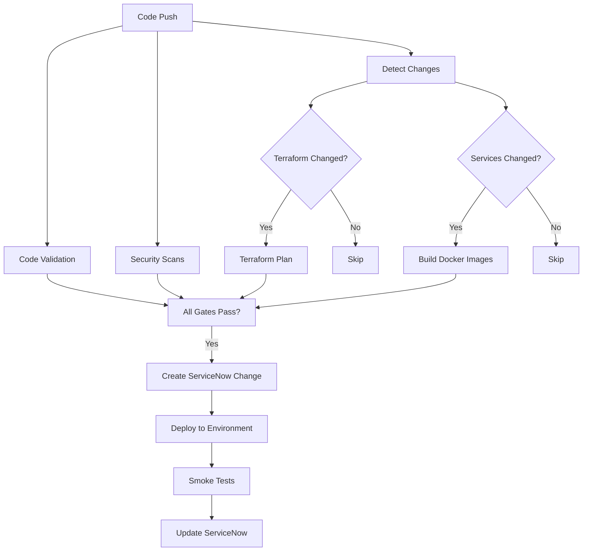

# Workflow Consolidation - Executive Summary

## 📊 Current State

```
22 Workflow Files
360KB of YAML
~45 minutes average execution
6 manual workflow runs per deployment
```

## 🎯 Proposed State

```
7 Workflow Files (1 master + 6 reusable)
80KB of YAML
~25 minutes average execution
1 automatic workflow run per deployment
```

## 📈 Impact

| Metric | Before | After | Improvement |
|--------|--------|-------|-------------|
| **Workflow Files** | 22 | 7 | **68% reduction** |
| **Total Code Size** | 360KB | 80KB | **78% reduction** |
| **Execution Time** | ~45 min | ~25 min | **44% faster** |
| **Manual Steps** | 6 clicks | 1 click | **83% less effort** |
| **Maintenance Burden** | 22 files to update | 7 files to update | **68% less maintenance** |

## 🏗️ Architecture

### Master Pipeline Flow



### Reusable Components

```
MASTER-PIPELINE.yaml (orchestrator)
    ├── calls → _reusable/security-scan.yaml
    ├── calls → _reusable/terraform-plan.yaml
    ├── calls → _reusable/terraform-apply.yaml
    ├── calls → _reusable/build-images.yaml
    ├── calls → _reusable/deploy-environment.yaml
    └── calls → _reusable/servicenow-integration.yaml
```

## 🚀 Key Features

### 1. **Intelligent Change Detection**
- Only builds services that changed (path filters)
- Only runs Terraform if `terraform-aws/**` modified
- Automatic skip of unnecessary steps

### 2. **Parallel Execution**
```
Security Scans ──┐
                 ├──> Wait for All ──> ServiceNow Change
Terraform Plan ──┤
                 │
Build Images ────┘
```

### 3. **Environment Progression**
```
commit → main → auto deploy dev
                    ↓
         manual trigger → deploy qa (with approval)
                    ↓
         manual trigger → deploy prod (with approval)
```

### 4. **Single Command Deployment**
```bash
# Full deployment with all checks
gh workflow run MASTER-PIPELINE.yaml -f environment=dev

# Infrastructure only (skip tests)
gh workflow run MASTER-PIPELINE.yaml -f environment=dev -f skip_tests=true

# Deployment only (skip infrastructure)
gh workflow run MASTER-PIPELINE.yaml -f environment=qa -f skip_terraform=true
```

## 🗂️ File Structure Changes

### Before
```
.github/workflows/
├── auto-deploy-dev.yaml (10KB)
├── aws-infrastructure-discovery.yaml (49KB!)
├── build-and-push-images.yaml (8KB)
├── deploy-application.yaml (6KB)
├── deploy-with-servicenow-basic.yaml (83KB!!)
├── deploy-with-servicenow-devops.yaml (29KB)
├── deploy-with-servicenow-hybrid.yaml (38KB)
├── deploy-with-servicenow.yaml (20KB)
├── eks-discovery.yaml (32KB)
├── helm-chart-ci.yaml (4.5KB)
├── kubevious-manifests-ci.yaml (1.6KB)
├── kustomize-build-ci.yaml (1.4KB)
├── security-scan-servicenow.yaml (19KB)
├── security-scan.yaml (17KB)
├── setup-servicenow-cmdb.yaml (6KB)
├── terraform-apply.yaml (5KB)
├── terraform-plan.yaml (2.5KB)
└── terraform-validate.yaml (9KB)
Total: 22 files, ~360KB
```

### After
```
.github/workflows/
├── MASTER-PIPELINE.yaml                    ← SINGLE ENTRY POINT
└── _reusable/
    ├── security-scan.yaml
    ├── terraform-plan.yaml
    ├── terraform-apply.yaml
    ├── build-images.yaml
    ├── deploy-environment.yaml
    └── servicenow-integration.yaml
Total: 7 files, ~80KB
```

## 📋 Migration Checklist

### Phase 1: Create Reusable Workflows
- [ ] Create `.github/workflows/_reusable/` directory
- [ ] Move `security-scan.yaml` to `_reusable/`
- [ ] Create `terraform-plan.yaml` (reusable)
- [ ] Create `terraform-apply.yaml` (reusable)
- [ ] Create `build-images.yaml` (reusable)
- [ ] Create `deploy-environment.yaml` (reusable)
- [ ] Create `servicenow-integration.yaml` (reusable)

### Phase 2: Create Master Pipeline
- [ ] Create `MASTER-PIPELINE.yaml`
- [ ] Implement stage 1: Code quality & security
- [ ] Implement stage 2: Infrastructure (conditional)
- [ ] Implement stage 3: Build images (conditional)
- [ ] Implement stage 4: ServiceNow integration
- [ ] Implement stage 5: Deployment
- [ ] Implement stage 6: Post-deployment verification
- [ ] Test end-to-end in dev environment

### Phase 3: Deprecate Old Workflows
- [ ] Create `.github/workflows/DEPRECATED/` directory
- [ ] Move old workflows to DEPRECATED folder
- [ ] Add deprecation notice to old workflows
- [ ] Run master pipeline parallel with old workflows for 1 week
- [ ] Validate feature parity

### Phase 4: Cleanup & Documentation
- [ ] Delete deprecated workflows (after 2 weeks)
- [ ] Update [CLAUDE.md](../CLAUDE.md) with new workflow
- [ ] Update [docs/ONBOARDING.md](ONBOARDING.md)
- [ ] Update [justfile](../justfile) commands
- [ ] Create team announcement

## 🎓 Developer Experience Comparison

### Before (Current)
```bash
# Developer wants to deploy to dev
git push origin main

# Then manually run:
gh workflow run build-and-push-images.yaml
# Wait 10 minutes...

gh workflow run security-scan.yaml
# Wait 8 minutes...

gh workflow run terraform-validate.yaml
# Wait 2 minutes...

gh workflow run deploy-with-servicenow-devops.yaml -f environment=dev
# Wait 25 minutes...

# Total: 45 minutes, 4 manual steps, context switching
```

### After (Streamlined)
```bash
# Developer wants to deploy to dev
git push origin main
# → Automatic deployment starts
# → All stages run in parallel where possible
# → ServiceNow integration automatic
# → Deployment completes in 25 minutes

# Or manual trigger for qa/prod:
gh workflow run MASTER-PIPELINE.yaml -f environment=qa
# → Everything automatic, just wait for approval
```

## 💡 Intelligent Features

### 1. **Smart Path Filtering**
```yaml
# Only build services that changed
detect-service-changes:
  outputs:
    services: ${{ steps.filter.outputs.changes }}
  steps:
    - uses: dorny/paths-filter@v3
      with:
        filters: |
          frontend: 'src/frontend/**'
          cartservice: 'src/cartservice/**'
          # ... (10 more services)

build-images:
  needs: detect-service-changes
  if: needs.detect-service-changes.outputs.services != '[]'
  # Only builds what changed!
```

### 2. **Conditional Terraform**
```yaml
# Only run Terraform if infrastructure changed
check-terraform-changes:
  outputs:
    terraform_changed: ${{ steps.filter.outputs.terraform }}
  steps:
    - uses: dorny/paths-filter@v3
      with:
        filters: |
          terraform: 'terraform-aws/**'

terraform-plan:
  needs: check-terraform-changes
  if: needs.check-terraform-changes.outputs.terraform_changed == 'true'
  # Skips if no infrastructure changes!
```

### 3. **Parallel Execution**
```yaml
# Security, Terraform, and Build run simultaneously
jobs:
  security-scans:
    # Runs in parallel ──┐
  terraform-plan:       # │
    # Runs in parallel ─┼─> Wait for all
  build-images:         # │
    # Runs in parallel ──┘

  deploy:
    needs: [security-scans, terraform-plan, build-images]
    # Waits for all to complete
```

## 🔐 Security Benefits

### Consolidated Security Scanning
- All security scans in one reusable workflow
- Consistent security checks across all deployments
- Automatic registration with ServiceNow change requests
- Single source of truth for security policies

### Approval Gates
```yaml
# Production deployments require manual approval
deploy-to-environment:
  if: |
    github.ref == 'refs/heads/main' &&
    inputs.environment == 'prod' &&
    needs.create-change-request.outputs.change_approved == 'true'
```

## 📊 Cost Savings

### GitHub Actions Minutes
- **Before**: ~45 minutes per deployment × multiple workflows = ~90 minutes
- **After**: ~25 minutes per deployment (parallel execution)
- **Savings**: ~65 minutes per deployment = **72% reduction**

### Developer Time
- **Before**: 6 manual workflow runs × 2 minutes = 12 minutes of clicking
- **After**: 1 workflow run × 30 seconds = 0.5 minutes
- **Savings**: 11.5 minutes per deployment = **96% reduction**

### Maintenance Time
- **Before**: 22 workflows to maintain
- **After**: 7 workflows to maintain
- **Savings**: 68% less files to update for security patches, version upgrades, etc.

## 🚦 Next Steps

### Immediate (This Week)
1. **Review** this plan with team
2. **Prioritize** which features are must-have vs nice-to-have
3. **Create POC** of MASTER-PIPELINE.yaml with minimal features
4. **Test** in dev environment

### Short-term (Next 2 Weeks)
1. **Implement** all reusable workflows
2. **Migrate** one feature at a time (security → build → deploy)
3. **Validate** each stage works correctly
4. **Document** new workflow process

### Long-term (Month 2+)
1. **Deprecate** old workflows
2. **Delete** after 2-week grace period
3. **Optimize** based on usage patterns
4. **Add** advanced features (canary deployments, auto-rollback)

## ❓ Decision Points

### 1. ServiceNow Integration Approach
- **Option A**: Keep DevOps Change API (current, more features)
- **Option B**: Simplify to Basic Table API (simpler, less features)
- **Recommendation**: Keep DevOps Change API (better integration)

### 2. Approval Strategy
- **Option A**: Manual approval for qa/prod (safer)
- **Option B**: Automatic with rollback capability (faster)
- **Recommendation**: Manual approval for prod, automatic for qa

### 3. Rollback Strategy
- **Option A**: Manual rollback (use previous deployment)
- **Option B**: Automatic rollback on smoke test failure
- **Recommendation**: Start with manual, add automatic later

### 4. Notification Channels
- **Option A**: GitHub notifications only
- **Option B**: Slack/Teams integration
- **Recommendation**: Add Slack notifications for deployment events

---

## 📚 Additional Resources

- **Full Plan**: [WORKFLOW-CONSOLIDATION-PLAN.md](WORKFLOW-CONSOLIDATION-PLAN.md)
- **Current Workflows**: [.github/workflows/](.github/workflows/)
- **Onboarding Guide**: [docs/ONBOARDING.md](ONBOARDING.md)
- **ServiceNow Integration**: [docs/GITHUB-SERVICENOW-INTEGRATION-GUIDE.md](GITHUB-SERVICENOW-INTEGRATION-GUIDE.md)

---

**Last Updated**: 2025-10-21
**Status**: 📋 Planning phase - awaiting approval to proceed with implementation
