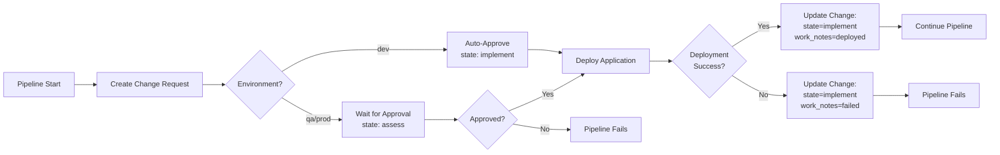

# ServiceNow Change Request Lifecycle Management

> **Status**: Implemented
> **Last Updated**: 2025-10-28
> **Version**: 1.0.0

## Overview

This document explains how we automatically manage the complete lifecycle of ServiceNow change requests throughout our CI/CD pipeline - from creation through deployment to final closure.

## Architecture



## Workflow Components

### 1. Change Request Creation
**File**: `.github/workflows/servicenow-change-rest.yaml`

**What it does**:
- Creates a change request in ServiceNow at the start of deployment
- Populates all required fields (description, plans, risk, impact)
- Sets initial state based on environment:
  - **dev**: `implement` (auto-approved)
  - **qa/prod**: `assess` (awaiting approval)
- Waits for approval in qa/prod (polls every 60 seconds, max 1 hour)

**Outputs**:
- `change_number`: Change request number (e.g., CHG0123456)
- `change_sys_id`: System ID for API updates

**Example**:
```yaml
servicenow-change:
  uses: ./.github/workflows/servicenow-change-rest.yaml
  with:
    environment: prod
    short_description: 'Deploy microservices to prod'
  outputs:
    change_number: ${{ jobs.servicenow-change.outputs.change_number }}
```

### 2. Change Request Update After Deployment
**File**: `.github/workflows/servicenow-update-change.yaml` (new)

**What it does**:
- Updates the change request after deployment completes (success or failure)
- Uses ServiceNow DevOps GitHub Actions for reliable updates
- Adds detailed work notes with deployment information
- Optionally closes the change request (configurable)

**Required Secrets**:
- `SERVICENOW_DEVOPS_TOKEN` or `SERVICENOW_USERNAME`/`SERVICENOW_PASSWORD`
- `SN_ORCHESTRATION_TOOL_ID`
- `SERVICENOW_INSTANCE_URL`

**State Transitions**:

| Scenario | Current State | New State | Work Notes |
|----------|---------------|-----------|------------|
| Dev Success | implement | implement | Deployed successfully to dev |
| Dev Failure | implement | implement | Deployment failed (see logs) |
| QA/Prod Success | implement/scheduled | implement | Deployed successfully + pod counts |
| QA/Prod Failure | implement/scheduled | implement | Deployment failed + error details |
| Close on Success | implement | closed | Deployment complete, closing change |

**Example**:
```yaml
update-change:
  needs: [servicenow-change, deploy]
  if: always()
  uses: ./.github/workflows/servicenow-update-change.yaml
  with:
    environment: prod
    change_request_number: ${{ needs.servicenow-change.outputs.change_number }}
    deployment_status: ${{ needs.deploy.result }}
```

## ServiceNow States

Understanding ServiceNow change request states:

| State | Value | Meaning | When Used |
|-------|-------|---------|-----------|
| New | -5 | Just created | Never used (we skip this) |
| Assess | -4 | Awaiting approval | Initial state for qa/prod |
| Authorize | -3 | CAB review | Not used (ServiceNow internal) |
| Scheduled | -2 | Approved, waiting | After approval in qa/prod |
| Implement | -1 | Being deployed | During deployment |
| Review | 0 | Post-deployment | After successful deployment |
| Closed | 3 | Complete | Final state (optional) |
| Canceled | 4 | Cancelled | Not used |

## Implementation Details

### Authentication Methods

We support **two authentication methods** (choose one based on ServiceNow version):

#### Option 1: Token-Based (v2.0+, Recommended)
```yaml
- uses: ServiceNow/servicenow-devops-update-change@v2.0.0
  with:
    devops-integration-token: ${{ secrets.SERVICENOW_DEVOPS_TOKEN }}
    tool-id: ${{ secrets.SN_ORCHESTRATION_TOOL_ID }}
    instance-url: ${{ secrets.SERVICENOW_INSTANCE_URL }}
```

**Setup**:
1. Create integration token in ServiceNow (System DevOps > Tools > GitHub)
2. Store as `SERVICENOW_DEVOPS_TOKEN` secret in GitHub
3. Get tool sys_id and store as `SN_ORCHESTRATION_TOOL_ID`

#### Option 2: Basic Authentication (Legacy)
```yaml
- uses: ServiceNow/servicenow-devops-update-change@v2.0.0
  with:
    devops-integration-user-name: ${{ secrets.SERVICENOW_USERNAME }}
    devops-integration-user-password: ${{ secrets.SERVICENOW_PASSWORD }}
    instance-url: ${{ secrets.SERVICENOW_INSTANCE_URL }}
```

**Setup**:
1. Use existing `SERVICENOW_USERNAME` and `SERVICENOW_PASSWORD` secrets
2. User must have `sn_devops.devops_user` role

### Update Payload Structure

The `change-request-details` parameter accepts a JSON object:

```json
{
  "state": "-1",
  "work_notes": "Deployment completed successfully\n\nEnvironment: prod\nRunning Pods: 30/30\nCommit: abc123\n\nAll services deployed and healthy.",
  "close_code": "successful",
  "close_notes": "Deployment verified and application is healthy"
}
```

**Important**: Always specify `state` last to avoid conflicts when updating multiple fields.

### Work Notes Best Practices

**Include**:
- ✅ Environment (dev/qa/prod)
- ✅ Deployment status (success/failure)
- ✅ Pod health (running/total)
- ✅ Commit SHA and actor
- ✅ Error details (if failed)
- ✅ Frontend URL (if available)

**Example Work Note**:
```
Deployment completed successfully to prod environment

Environment: prod
Namespace: microservices-prod
Status: success
Running Pods: 30/30
Frontend URL: http://k8s-istio-istio-abc123.elb.eu-west-2.amazonaws.com
Commit: 1234567890abcdef by @olafkfreund
Workflow Run: https://github.com/Freundcloud/microservices-demo/actions/runs/123456789

All services deployed and healthy.
```

## Integration into Existing Workflows

### deploy-environment.yaml

**Before**:
```yaml
jobs:
  servicenow-change:
    uses: ./.github/workflows/servicenow-change-rest.yaml

  deploy:
    needs: servicenow-change
    # ... deployment steps
```

**After**:
```yaml
jobs:
  servicenow-change:
    uses: ./.github/workflows/servicenow-change-rest.yaml
    outputs:
      change_number: ${{ jobs.create-change.outputs.change_number }}

  deploy:
    needs: servicenow-change
    outputs:
      status: ${{ steps.deployment-status.outputs.status }}
      # ... other outputs

  update-servicenow-change:
    needs: [servicenow-change, deploy]
    if: always() && needs.servicenow-change.outputs.change_number != ''
    uses: ./.github/workflows/servicenow-update-change.yaml
    with:
      environment: ${{ inputs.environment }}
      change_request_number: ${{ needs.servicenow-change.outputs.change_number }}
      deployment_status: ${{ needs.deploy.result }}
      running_pods: ${{ needs.deploy.outputs.running_pods }}
      total_pods: ${{ needs.deploy.outputs.total_pods }}
      frontend_url: ${{ needs.deploy.outputs.frontend_url }}
```

### MASTER-PIPELINE.yaml

Similar integration at the end of the pipeline after smoke tests.

## Configuration Options

### Auto-Close on Success

By default, we **do not** automatically close change requests. Instead, we:
1. Update state to `implement` (deployed)
2. Add work notes with deployment details
3. Leave change in `implement` state for review

**To enable auto-close**:
```yaml
update-servicenow-change:
  with:
    auto_close: true  # Close change on successful deployment
```

### Environment-Specific Behavior

| Environment | Auto-Approve | Auto-Close | Work Notes Detail |
|-------------|--------------|------------|-------------------|
| dev | ✅ Yes | ❌ No | Basic (status + pods) |
| qa | ❌ No | ❌ No | Detailed (all info) |
| prod | ❌ No | ❌ No | Comprehensive (all info + URL) |

## Troubleshooting

### Change Request Not Found

**Error**: `Change request CHG0123456 not found`

**Cause**: Change number wasn't passed correctly or doesn't exist

**Solution**:
1. Check `servicenow-change` job outputs in workflow logs
2. Verify change request exists in ServiceNow
3. Ensure `needs.servicenow-change.outputs.change_number` is populated

### Authentication Failures

**Error**: `HTTP 401: Unauthorized`

**Solution for Token-Based Auth**:
1. Verify `SERVICENOW_DEVOPS_TOKEN` is valid and not expired
2. Check `SN_ORCHESTRATION_TOOL_ID` matches GitHub tool in ServiceNow
3. Ensure tool is active in ServiceNow (System DevOps > Tools)

**Solution for Basic Auth**:
1. Verify `SERVICENOW_USERNAME` and `SERVICENOW_PASSWORD` are correct
2. User must have `sn_devops.devops_user` role
3. Check instance URL format (no trailing slash)

### Update Fails but Deployment Succeeds

**Error**: `Failed to update change request`

**Impact**: Pipeline continues (using `continue-on-error: true`)

**Solution**:
1. Check ServiceNow logs (System Logs > System Log > REST API)
2. Verify all required fields are provided
3. Manually update change request in ServiceNow if needed

### State Transition Not Allowed

**Error**: `Invalid state transition from X to Y`

**Cause**: ServiceNow state machine rules prevent direct transitions

**Solution**:
1. Check current state in ServiceNow
2. Use intermediate states if needed (e.g., assess → scheduled → implement)
3. Verify change workflow in ServiceNow matches our expectations

## Testing

### Manual Testing

1. **Trigger deployment**:
   ```bash
   just promote 1.2.5 dev
   ```

2. **Check change request creation**:
   - Navigate to ServiceNow → Change Management → Normal Changes
   - Find change for your deployment
   - Verify initial state and fields

3. **Wait for deployment**:
   - Watch GitHub Actions workflow
   - Check deployment succeeds/fails

4. **Verify change update**:
   - Refresh ServiceNow change request
   - Check work notes added
   - Verify state updated

### Validation Checklist

- [ ] Change request created with correct initial state
- [ ] Approval required for qa/prod (not dev)
- [ ] Deployment proceeds after approval
- [ ] Change request updated after deployment
- [ ] Work notes include all relevant information
- [ ] State transitions are valid
- [ ] Failed deployments update change correctly
- [ ] Successful deployments update change correctly

## Benefits

### Traceability
- Complete audit trail from code commit to production deployment
- Every deployment linked to approved change request
- Work notes provide deployment history

### Compliance
- ITIL-compliant change management
- Approval workflow for production changes
- Risk and impact assessment before deployment

### Automation
- No manual ServiceNow updates required
- Automatic change closure (optional)
- Real-time status updates

### Visibility
- ServiceNow as single source of truth
- Deployment status visible to stakeholders
- Integration between GitHub and ServiceNow

## Future Enhancements

### Planned Features
1. **Get Change Request**: Use `servicenow-devops-get-change` to retrieve existing change for rollback scenarios
2. **Rollback Support**: Automatically update change when rolling back deployment
3. **Metrics Integration**: Link deployment metrics (response time, error rate) to change request
4. **Attachment Support**: Upload deployment artifacts (logs, manifests) to change request

### Considerations
- **Close Code Mapping**: Map deployment outcomes to ServiceNow close codes
- **Custom Fields**: Support for organization-specific custom fields
- **Multi-Environment Tracking**: Link related changes across dev/qa/prod
- **Approval Automation**: Auto-approve based on security scan results

## References

### ServiceNow DevOps GitHub Actions
- [servicenow-devops-update-change](https://github.com/ServiceNow/servicenow-devops-update-change) - Update change requests
- [servicenow-devops-get-change](https://github.com/ServiceNow/servicenow-devops-get-change) - Retrieve change requests

### Internal Documentation
- [ServiceNow Change Request Creation](servicenow-change-rest.yaml) - REST API workflow
- [SBOM Integration](SBOM-SERVICENOW-INTEGRATION.md) - Software inventory tracking
- [Master Pipeline](../.github/workflows/MASTER-PIPELINE.yaml) - Complete CI/CD flow

### ServiceNow Documentation
- [Change Management](https://docs.servicenow.com/bundle/vancouver-it-service-management/page/product/change-management/concept/c_ITILChangeManagement.html)
- [DevOps Change Control](https://docs.servicenow.com/bundle/vancouver-devops/page/product/enterprise-dev-ops/concept/devops-change-control.html)

---

**Questions?** See the [troubleshooting section](#troubleshooting) or consult ServiceNow documentation.
