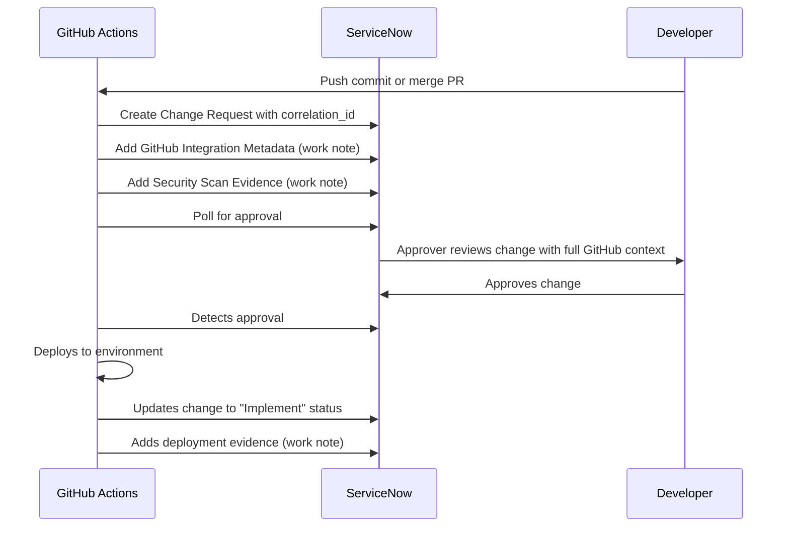

# GitHub-ServiceNow Work Item Association Guide

> **Status**: ✅ Implemented
> **Last Updated**: 2025-10-20
> **Version**: 1.0.0

## Overview

This guide documents how GitHub work items (commits, pull requests, workflow runs) are automatically associated with ServiceNow change requests in this repository. This bi-directional traceability enables complete audit trails and DevOps workflow visibility.

## What is Work Item Association?

**Work item association** creates linkages between GitHub activities and ServiceNow change requests, enabling:

- **Traceability**: Track which GitHub commits/PRs triggered which ServiceNow changes
- **Audit Trail**: Complete record of what changed, who changed it, and why
- **Compliance**: Meet regulatory requirements for change documentation
- **Visibility**: View all GitHub context directly in ServiceNow
- **DevOps Metrics**: Measure deployment frequency, lead time, change failure rate

## How It Works

### Automated Association Flow



### Key Components

1. **Correlation ID**: Unique identifier linking GitHub workflow to ServiceNow change
2. **Work Notes**: Detailed metadata added to ServiceNow change request
3. **GitHub Context**: Complete information about repository, commit, PR, workflow
4. **Security Evidence**: Scan results and compliance status
5. **Deployment Evidence**: Deployment results and verification

## Implementation Details

### 1. Correlation ID

Every change request gets a unique correlation ID that links it to the GitHub workflow run:

**Format**: `{repository}-{run_id}`

**Example**: `olafkfreund/microservices-demo-12345678`

**Where it's used**:
- ServiceNow change request `correlation_id` field
- ServiceNow change request `correlation_display` field
- GitHub Actions workflow tracking
- ServiceNow DevOps workspace filters

**Implementation** ([deploy-with-servicenow-basic.yaml](../.github/workflows/deploy-with-servicenow-basic.yaml#L353)):
```bash
CORRELATION_ID="${{ github.repository }}-${{ github.run_id }}"
```

### 2. GitHub Integration Metadata

Comprehensive GitHub context is automatically added to every change request as a work note.

**What's Included**:

#### Repository Information
- **Repository**: Full repository name (e.g., `olafkfreund/microservices-demo`)
- **Branch**: Source branch name (e.g., `main`, `feature/new-service`)
- **Commit SHA**: Full 40-character commit hash
- **Commit Message**: First line of commit message
- **Commit Author**: Git author name and email

#### Workflow Context
- **Triggered By**: GitHub username who triggered the workflow
- **Trigger Event**: How workflow was triggered (e.g., `workflow_dispatch`, `push`, `pull_request`)
- **Pull Request**: PR number and title (if applicable)
- **Workflow Run URL**: Direct link to GitHub Actions run
- **Run Number**: Sequential run number for this workflow

#### Deployment Details
- **Environment**: Target environment (dev/qa/prod)
- **Namespace**: Kubernetes namespace
- **Deployment Type**: Infrastructure type (Kubernetes AWS EKS)
- **Deployment Method**: How it's deployed (Kustomize Overlay)

#### Useful Links
- **Repository URL**: Link to repository home
- **Commit URL**: Link to specific commit
- **Security URL**: Link to repository security tab

#### Metadata
- **Timestamp**: When metadata was added (UTC)
- **Correlation ID**: Tracking identifier

**Implementation** ([deploy-with-servicenow-basic.yaml](../.github/workflows/deploy-with-servicenow-basic.yaml#L328-432)):

```yaml
- name: Add GitHub Integration metadata to Change Request
  run: |
    CHANGE_SYS_ID="${{ needs.create-change-request.outputs.change_request_sys_id }}"
    CHANGE_NUMBER="${{ needs.create-change-request.outputs.change_request_number }}"
    BASIC_AUTH=$(echo -n "${{ secrets.SERVICENOW_USERNAME }}:${{ secrets.SERVICENOW_PASSWORD }}" | base64)

    # Extract commit metadata
    COMMIT_MSG=$(git log -1 --pretty=%s)
    COMMIT_AUTHOR=$(git log -1 --pretty="%an <%ae>")

    # Extract PR info if available
    if [ "${{ github.event_name }}" == "pull_request" ]; then
      PR_INFO="Pull Request: #${{ github.event.pull_request.number }} - ${{ github.event.pull_request.title }}"
    else
      PR_INFO="Direct commit (no PR)"
    fi

    # Build correlation tracking info
    CORRELATION_ID="${{ github.repository }}-${{ github.run_id }}"

    # Build comprehensive GitHub metadata using jq
    PAYLOAD=$(jq -n \
      --arg repo "${{ github.repository }}" \
      --arg branch "${{ github.ref_name }}" \
      --arg commit "${{ github.sha }}" \
      --arg commit_msg "${COMMIT_MSG}" \
      --arg commit_author "${COMMIT_AUTHOR}" \
      --arg actor "${{ github.actor }}" \
      --arg event "${{ github.event_name }}" \
      --arg pr_info "${PR_INFO}" \
      --arg workflow_url "${{ github.server_url }}/${{ github.repository }}/actions/runs/${{ github.run_id }}" \
      --arg run_number "${{ github.run_number }}" \
      --arg correlation_id "${CORRELATION_ID}" \
      --arg repo_url "${{ github.server_url }}/${{ github.repository }}" \
      --arg commit_url "${{ github.server_url }}/${{ github.repository }}/commit/${{ github.sha }}" \
      --arg security_url "${{ github.server_url }}/${{ github.repository }}/security" \
      --arg environment "${{ github.event.inputs.environment }}" \
      --arg namespace "microservices-${{ github.event.inputs.environment }}" \
      --arg timestamp "$(date -u +'%Y-%m-%d %H:%M:%S UTC')" \
      '{
        work_notes: (
          "GitHub Integration Metadata\n\n" +
          "Repository: \($repo)\n" +
          "Branch: \($branch)\n" +
          "Commit: \($commit)\n" +
          "Commit Message: \($commit_msg)\n" +
          "Commit Author: \($commit_author)\n\n" +
          "Triggered By: \($actor)\n" +
          "Trigger Event: \($event)\n" +
          "\($pr_info)\n\n" +
          "Workflow Run: \($workflow_url)\n" +
          "Run Number: #\($run_number)\n" +
          "Correlation ID: \($correlation_id)\n\n" +
          "Links:\n" +
          "- Repository: \($repo_url)\n" +
          "- Commit: \($commit_url)\n" +
          "- Security: \($security_url)\n\n" +
          "Deployment:\n" +
          "- Environment: \($environment)\n" +
          "- Namespace: \($namespace)\n" +
          "- Type: Kubernetes (AWS EKS)\n" +
          "- Method: Kustomize Overlay\n\n" +
          "Timestamp: \($timestamp)\n\n" +
          "Note: This change request was automatically created and tracked by GitHub Actions."
        )
      }'
    )

    # Add metadata with retry logic
    curl -X PATCH \
      -H "Authorization: Basic $BASIC_AUTH" \
      -H "Content-Type: application/json" \
      -d "$PAYLOAD" \
      "${{ secrets.SERVICENOW_INSTANCE_URL }}/api/now/table/change_request/$CHANGE_SYS_ID"
```

### 3. Security Scan Evidence

Detailed security scan results are automatically added as work notes, including:

- **Compliance Status**: Whether all security scans passed
- **Total Findings**: Number of security issues detected
- **Scan Types**: Which scanners were run (Trivy, Gitleaks, Semgrep, etc.)
- **Severity Breakdown**: Count by severity (Critical, High, Medium, Low)
- **Artifact Links**: Links to detailed scan reports in GitHub Actions

**Implementation** ([deploy-with-servicenow-basic.yaml](../.github/workflows/deploy-with-servicenow-basic.yaml#L434-510)):

This work note is added after security scans complete and includes full evidence.

### 4. Deployment Evidence

After deployment completes, detailed deployment results are added:

- **Deployment Status**: Success or failure
- **Deployment Duration**: How long deployment took
- **Kubernetes Resources**: Deployed resources status
- **Verification Results**: Health checks and validations
- **Rollback Information**: If deployment failed

**Implementation** ([deploy-with-servicenow-basic.yaml](../.github/workflows/deploy-with-servicenow-basic.yaml#L706-832)):

This work note is added after deployment completes.

## Viewing Associations in ServiceNow

### In Change Request Form

1. **Navigate to change request** in ServiceNow
2. **Scroll to "Work Notes" tab** to view all GitHub metadata
3. **Look for "GitHub Integration Metadata"** section with:
   - Repository and branch information
   - Commit details and author
   - Workflow run links
   - Deployment context

### Using Correlation ID

**Search by correlation ID**:
```
Filter: correlation_id = olafkfreund/microservices-demo-12345678
```

**View all changes for a repository**:
```
Filter: correlation_id STARTSWITH olafkfreund/microservices-demo
```

### In DevOps Workspace (if configured)

1. Navigate to **DevOps > Workspace**
2. View **GitHub integration status**
3. Filter changes by:
   - Repository
   - Branch
   - Environment
   - Status

## Viewing Associations in GitHub

### In Workflow Run

1. **Navigate to Actions tab** in GitHub
2. **Click on workflow run**
3. **View "Upload Security Evidence" job** for:
   - Change request number
   - ServiceNow URL
   - Correlation ID

### In Pull Request

When PR is merged and triggers deployment:

1. **PR is merged** to main/staging branch
2. **Workflow runs** automatically
3. **Check "Actions" tab** of PR for:
   - Link to workflow run
   - Change request number (in logs)

## Best Practices

### For Developers

1. **Write clear commit messages**: They appear in ServiceNow change requests
2. **Use descriptive PR titles**: Included in change metadata
3. **Check workflow logs**: Verify change request was created successfully
4. **Reference correlation ID**: When communicating with change managers

### For Approvers

1. **Review GitHub metadata**: Check repository, branch, commit in work notes
2. **Verify commit author**: Ensure changes are from authorized developers
3. **Check security scans**: Review security evidence work note
4. **Click workflow run link**: View complete GitHub Actions execution
5. **Verify environment**: Ensure deploying to correct environment (dev/qa/prod)

### For Administrators

1. **Monitor correlation IDs**: Ensure they're unique and consistent
2. **Validate work notes**: Check that GitHub metadata is being added
3. **Review API calls**: Monitor ServiceNow API usage and errors
4. **Set up alerts**: Notify on failed change request creation
5. **Audit regularly**: Verify associations are working correctly

## Troubleshooting

### Change Request Created But No GitHub Metadata

**Symptom**: Change request exists but work notes don't have GitHub metadata

**Possible Causes**:
1. Workflow step failed after change creation
2. API timeout or rate limiting
3. Insufficient permissions

**Fix**:
```bash
# Check workflow logs
gh run view <run-id> --log-failed

# Look for "Add GitHub Integration metadata" step
# Check for HTTP errors or timeouts
```

### Correlation ID Missing

**Symptom**: Change request created without correlation_id field

**Possible Causes**:
1. Correlation ID field not created in ServiceNow
2. API payload not including correlation_id
3. Field permissions issue

**Fix**:
1. Run diagnostic script: `docs/setup/servicenow-diagnostic.sh`
2. Verify correlation_id field exists in change_request table
3. Check field permissions for integration user

### Work Note Not Added

**Symptom**: GitHub metadata work note missing from change request

**Possible Causes**:
1. PATCH API call failed
2. Work notes field permissions
3. Retry logic exhausted

**Fix**:
```bash
# Check workflow logs for PATCH call
# Look for HTTP status codes
# Verify ServiceNow API response

# Manually test API call:
curl -X PATCH \
  -H "Authorization: Basic $(echo -n 'username:password' | base64)" \
  -H "Content-Type: application/json" \
  -d '{"work_notes": "Test note"}' \
  "https://instance.service-now.com/api/now/table/change_request/SYS_ID"
```

### Duplicate Associations

**Symptom**: Multiple change requests for same workflow run

**Possible Causes**:
1. Workflow retry creating duplicate changes
2. Manual re-run of job
3. Job dependency issue

**Fix**:
1. Check for duplicate correlation IDs in ServiceNow
2. Review workflow trigger events
3. Add idempotency checks to change creation

## Advanced Configuration

### Custom Fields

Add custom GitHub metadata fields to change requests:

1. **Create custom fields** in ServiceNow change_request table
2. **Modify workflow** to include additional GitHub context:
   ```yaml
   --arg custom_field "value" \
   '{
     work_notes: "...",
     u_custom_field: $custom_field
   }'
   ```

### Bi-directional Updates

Update GitHub from ServiceNow (requires additional setup):

1. **ServiceNow Business Rule**: Trigger on change request approval
2. **Outbound REST Message**: Call GitHub API to update commit status
3. **GitHub App**: Authenticate ServiceNow to GitHub

Example ServiceNow outbound REST call:
```javascript
var request = new sn_ws.RESTMessageV2();
request.setHttpMethod('POST');
request.setEndpoint('https://api.github.com/repos/owner/repo/statuses/' + commit_sha);
request.setRequestHeader('Authorization', 'Bearer ' + github_token);
request.setRequestBody(JSON.stringify({
  state: 'success',
  description: 'Change ' + change_number + ' approved',
  context: 'ServiceNow/change-management'
}));
var response = request.execute();
```

### ServiceNow DevOps Integration

For full DevOps workspace integration:

1. **Install ServiceNow DevOps plugin**: com.snc.devops
2. **Configure GitHub tool**: Register GitHub as DevOps tool
3. **Set up webhook**: GitHub sends events to ServiceNow
4. **Map workflows**: Associate GitHub Actions with ServiceNow pipelines

See: [ServiceNow DevOps Integration Guide](GITHUB-SERVICENOW-INTEGRATION-GUIDE.md)

## Security Considerations

### Credential Management

- ✅ **Use GitHub Secrets**: Never hardcode ServiceNow credentials
- ✅ **Rotate regularly**: Change passwords/tokens every 90 days
- ✅ **Minimal permissions**: Integration user should have least privilege
- ✅ **Audit access**: Monitor who accesses integration credentials

### Data Privacy

- ✅ **Sanitize commit messages**: Don't include secrets or PII
- ✅ **Review work notes**: Ensure no sensitive data in metadata
- ✅ **Limit visibility**: Restrict change request access to authorized users
- ✅ **Compliance**: Ensure data handling meets regulations (GDPR, SOC2, etc.)

### API Security

- ✅ **Use HTTPS**: All API calls over TLS
- ✅ **Rate limiting**: Implement backoff and retry logic
- ✅ **Input validation**: Sanitize all data sent to ServiceNow
- ✅ **Error handling**: Don't expose credentials in error messages

## Metrics and Reporting

### Key Metrics to Track

1. **Association Success Rate**: % of deployments with proper ServiceNow linkage
2. **Approval Time**: Time from change creation to approval
3. **Deployment Frequency**: Changes per week/month
4. **Change Failure Rate**: % of changes that fail deployment
5. **Lead Time**: Time from commit to production

### ServiceNow Reports

Create reports in ServiceNow to analyze:

```sql
-- Changes by repository
SELECT correlation_id, COUNT(*) as change_count
FROM change_request
WHERE correlation_id LIKE 'olafkfreund/%'
GROUP BY correlation_id

-- Average approval time
SELECT AVG(DATEDIFF(approved_on, sys_created_on)) as avg_approval_hours
FROM change_request
WHERE correlation_id IS NOT NULL
AND state = 'Approved'

-- Deployment success rate
SELECT
  COUNT(CASE WHEN state = 'Closed' THEN 1 END) * 100.0 / COUNT(*) as success_rate
FROM change_request
WHERE correlation_id LIKE 'olafkfreund/microservices-demo%'
```

## Related Documentation

- **[GitHub-ServiceNow Integration Guide](GITHUB-SERVICENOW-INTEGRATION-GUIDE.md)** - Complete setup guide
- **[GitHub-ServiceNow Antipatterns](GITHUB-SERVICENOW-ANTIPATTERNS.md)** - Common mistakes to avoid
- **[GitHub-ServiceNow Best Practices](GITHUB-SERVICENOW-BEST-PRACTICES.md)** - Recommended patterns
- **[Developer Onboarding](GITHUB-SERVICENOW-DEVELOPER-ONBOARDING.md)** - New developer guide

## Changelog

### Version 1.0.0 (2025-10-20)

**Initial Implementation**:
- ✅ Correlation ID tracking
- ✅ GitHub integration metadata work notes
- ✅ Security scan evidence work notes
- ✅ Deployment evidence work notes
- ✅ Retry logic for API calls
- ✅ Comprehensive error handling

**Features**:
- Automatic association on every deployment
- Complete audit trail in ServiceNow
- Bi-directional traceability
- Rich GitHub context in work notes

## Support

### Getting Help

1. **Review this guide**: Most questions answered here
2. **Check workflow logs**: GitHub Actions > Workflow run > Job logs
3. **Run diagnostics**: `docs/setup/servicenow-diagnostic.sh`
4. **Review related docs**: See "Related Documentation" section above

### Reporting Issues

If you encounter issues with work item association:

1. **Gather information**:
   - Workflow run ID
   - Change request number
   - Error messages from logs
   - Expected vs actual behavior

2. **Check existing issues**: Search GitHub issues for similar problems

3. **Create new issue**: Include all gathered information

### Contributing

To improve this integration:

1. **Fork repository**
2. **Create feature branch**: `git checkout -b feature/improve-association`
3. **Make changes** and test thoroughly
4. **Update documentation** if needed
5. **Submit pull request** with detailed description

---

**Questions?** See [GITHUB-SERVICENOW-INTEGRATION-GUIDE.md](GITHUB-SERVICENOW-INTEGRATION-GUIDE.md) for complete integration documentation.
