# ServiceNow Integration Fix - Workflow Condition Issues

> **Date**: 2025-10-31
> **Status**: Fix Implemented
> **Issue**: Change requests not visible in ServiceNow DevOps tables

---

## Problem Summary

### Issues Identified

1. **ServiceNow Change Request jobs being skipped**
   - `servicenow-change` job showing `conclusion: skipped` in workflow runs
   - `register-packages` job showing `started_at: null`
   - No change requests being created in ServiceNow

2. **Root Cause**
   - Job had dependency on `register-packages` completing successfully
   - `register-packages` only runs when `build-and-push.result == 'success'`
   - When no services changed, `build-and-push` is skipped
   - This cascade caused entire ServiceNow integration to be skipped

3. **Impact**
   - No change requests created in ServiceNow for workflow runs without code changes
   - No audit trail for infrastructure-only changes
   - No test results uploaded for validation runs
   - Missing compliance evidence for deployments

---

## Solution Implemented

### Change 1: Remove `register-packages` Dependency from ServiceNow Change Job

**File**: `.github/workflows/MASTER-PIPELINE.yaml`

**Before** (Line 561):
```yaml
servicenow-change:
  name: "📝 ServiceNow Change Request"
  needs: [pipeline-init, register-packages, detect-service-changes, ...]
  if: |
    always() &&
    needs.pipeline-init.outputs.should_deploy == 'true' &&
    needs.pipeline-init.outputs.policy_ok == 'true' &&
    !inputs.skip_deploy
```

**After**:
```yaml
servicenow-change:
  name: "📝 ServiceNow Change Request"
  needs: [pipeline-init, detect-service-changes, detect-terraform-changes, security-scans, sonarcloud-scan, unit-test-summary, get-deployed-version]
  if: |
    always() &&
    needs.pipeline-init.outputs.should_deploy == 'true' &&
    needs.pipeline-init.outputs.policy_ok == 'true' &&
    !inputs.skip_deploy &&
    (needs.security-scans.result == 'success' || needs.security-scans.result == 'skipped') &&
    (needs.sonarcloud-scan.result == 'success' || needs.sonarcloud-scan.result == 'skipped') &&
    (needs.unit-test-summary.result == 'success' || needs.unit-test-summary.result == 'skipped')
```

**Changes**:
1. ✅ Removed `register-packages` from `needs` list
2. ✅ Added explicit checks for scan job results (success OR skipped)
3. ✅ Job now runs even when no packages are registered

**Benefits**:
- Change requests created for all deployment runs (not just code changes)
- Infrastructure-only changes now tracked in ServiceNow
- Test validation runs create change records
- Complete audit trail maintained

---

### Change 2: Created Diagnostic Script

**File**: `scripts/check-servicenow-tables.sh`

**Purpose**: Verify ServiceNow integration health and identify issues

**Features**:
1. **Check Standard ITSM Tables**
   - Verifies `change_request` table has GitHub Actions changes
   - Shows count and most recent record

2. **Check ServiceNow DevOps Tables**
   - `sn_devops_change_reference` - DevOps change tracking
   - `sn_devops_test_summary` - Test results
   - `sn_devops_test_result` - Individual test results
   - `sn_devops_work_item` - GitHub Issues integration
   - `sn_devops_artifact` - Package/artifact tracking
   - `sn_devops_security_result` - Security scan results

3. **Check Plugin Status**
   - Verifies ServiceNow DevOps plugin installation
   - Shows plugin version and active status

4. **Check Tool Registration**
   - Validates `SN_ORCHESTRATION_TOOL_ID` exists in ServiceNow
   - Confirms tool is properly configured

5. **Recommendations**
   - Identifies which approach is being used (REST API vs DevOps actions)
   - Suggests next steps based on findings

**Usage**:
```bash
# Run diagnostic
./scripts/check-servicenow-tables.sh

# Expected output shows:
# - Count of records in each table
# - Links to view records in ServiceNow
# - Plugin installation status
# - Tool registration status
# - Summary and recommendations
```

---

## Why This Fix Works

### Problem Flow (Before Fix)

```mermaid
graph TD
    A[Pipeline Triggered] --> B{Code Changes?}
    B -->|No| C[build-and-push SKIPPED]
    C --> D[register-packages SKIPPED]
    D --> E[servicenow-change SKIPPED]
    E --> F[❌ No Change Request Created]

    B -->|Yes| G[build-and-push SUCCESS]
    G --> H[register-packages SUCCESS]
    H --> I[servicenow-change RUNS]
    I --> J[✅ Change Request Created]
```



### Solution Flow (After Fix)

```mermaid
graph TD
    A[Pipeline Triggered] --> B{should_deploy=true?}
    B -->|No| C[servicenow-change SKIPPED]
    C --> D[PR or manual skip]

    B -->|Yes| E{Security Scans OK?}
    E -->|No| F[servicenow-change SKIPPED]
    F --> G[Security failure blocks deployment]

    E -->|Yes| H[servicenow-change RUNS]
    H --> I[✅ Change Request Created]
    I --> J{Packages Built?}
    J -->|Yes| K[Packages Registered]
    J -->|No| L[No Packages to Register]
    K --> M[Deploy]
    L --> M
```



### Key Differences

1. **ServiceNow job no longer depends on package registration**
   - Runs independently based on deployment intent
   - Not blocked by upstream build jobs

2. **Explicit scan result checks**
   - Allows skipped scans (e.g., for PRs with `skip_security=true`)
   - Blocks on failed scans (security gate)

3. **Package registration remains optional**
   - Registers packages when services are built
   - Doesn't block change request creation when no builds occur

---

## Expected Behavior After Fix

### Scenario 1: Full Deployment (Code Changes)

```
✅ detect-service-changes → has_changes=true
✅ build-and-push → SUCCESS (12 services built)
✅ register-packages → SUCCESS (12 packages registered)
✅ security-scans → SUCCESS
✅ unit-test-summary → SUCCESS
✅ servicenow-change → RUNS (change request created)
✅ deploy-to-environment → RUNS (deployment proceeds)
```

### Scenario 2: Infrastructure-Only Change (No Code Changes)

```
✅ detect-service-changes → has_changes=false
⏭️  build-and-push → SKIPPED (no code changes)
⏭️  register-packages → SKIPPED (no packages to register)
✅ security-scans → SUCCESS
⏭️  unit-test-summary → SKIPPED (no tests to run)
✅ servicenow-change → RUNS (change request created) ← FIX APPLIED HERE
✅ deploy-to-environment → RUNS (deployment proceeds)
```

### Scenario 3: Validation Run (No Deployment)

```
✅ detect-service-changes → has_changes=false
⏭️  build-and-push → SKIPPED
⏭️  register-packages → SKIPPED
✅ security-scans → SUCCESS
⏭️  unit-test-summary → SKIPPED
⏭️  servicenow-change → SKIPPED (should_deploy=false)
⏭️  deploy-to-environment → SKIPPED
```

---

## Verification Steps

### Step 1: Validate Workflow Syntax

```bash
# Check YAML syntax
yamllint .github/workflows/MASTER-PIPELINE.yaml

# Validate workflow
gh workflow view "🚀 Master CI/CD Pipeline" --repo Freundcloud/microservices-demo
```

### Step 2: Run Diagnostic Script

```bash
# Check ServiceNow table status
./scripts/check-servicenow-tables.sh
```

**Expected Output**:
```
========================================
ServiceNow DevOps Integration Check
========================================

1. Standard ITSM Tables
========================

Checking: Change Requests (from GitHub Actions)
  ✅ Found X records
     Latest: 2025-10-31 14:08:56
     View: https://calitiiltddemo3.service-now.com/change_request_list.do?sysparm_query=u_source=GitHub Actions

2. ServiceNow DevOps Tables
============================

Checking: DevOps Change References
  ❌ No records found
  ...

Summary:
  ✅ Standard Change Requests: Present
  ❌ DevOps Change References: Empty

Recommendations:
  ⚠️  You are using REST API approach (standard change_request table)
     - Change requests are being created successfully
     - But NOT appearing in DevOps tables
     - This is expected behavior for REST API integration
```

### Step 3: Trigger Test Deployment

```bash
# Option 1: Make infrastructure change (no code change)
# This tests the fix - change request should be created even without code changes
echo "# Test infrastructure change" >> terraform-aws/README.md
git add terraform-aws/README.md
git commit -m "test: Trigger infrastructure-only deployment to verify ServiceNow integration"
git push origin main

# Option 2: Use workflow dispatch with force_build_all
gh workflow run "🚀 Master CI/CD Pipeline" \
  --field environment=dev \
  --field force_build_all=false \
  --field skip_terraform=false
```

### Step 4: Monitor Workflow Execution

```bash
# Watch workflow run
gh run watch

# Check specific job status
gh run view --repo Freundcloud/microservices-demo --json jobs \
  --jq '.jobs[] | select(.name | contains("ServiceNow")) | {name, conclusion, started_at}'
```

**Expected**:
```json
{
  "name": "📝 ServiceNow Change Request",
  "conclusion": "success",
  "started_at": "2025-10-31T14:15:00Z"
}
```

### Step 5: Verify Change Request in ServiceNow

```bash
# Use diagnostic script
./scripts/check-servicenow-tables.sh

# Or check directly via API
source .envrc
curl -s -u "$SERVICENOW_USERNAME:$SERVICENOW_PASSWORD" \
  "$SERVICENOW_INSTANCE_URL/api/now/table/change_request?sysparm_query=u_source=GitHub Actions&sysparm_limit=1" \
  | jq '.result[0] | {number, short_description, state, sys_created_on}'
```

---

## Understanding ServiceNow DevOps Tables vs Standard Tables

### Current Implementation: REST API Approach

Your workflows use **REST API** to create change requests in the **standard `change_request` table**.

**Tables Used**:
- ✅ `change_request` (standard ITSM table)
- ✅ Custom fields (u_github_repo, u_environment, u_security_scan_status, etc.)

**Tables NOT Used** (require ServiceNow DevOps plugin actions):
- ❌ `sn_devops_change_reference`
- ❌ `sn_devops_test_summary`
- ❌ `sn_devops_test_result`

**Why This Approach**:
- ✅ Full control over custom fields (40+ fields)
- ✅ Works with any ServiceNow instance
- ✅ Complete audit trail and compliance evidence
- ✅ No dependency on DevOps plugin features

**Trade-offs**:
- ❌ Change requests don't appear in ServiceNow DevOps workspace
- ❌ No native DevOps dashboard visualization
- ❌ Manual approval polling required

### Alternative: ServiceNow DevOps Actions

To populate DevOps tables (`sn_devops_change_reference`, etc.):

**Option 1: Use Official Actions**
```yaml
- uses: ServiceNow/servicenow-devops-change@v6.1.0
  with:
    devops-integration-token: ${{ secrets.SN_DEVOPS_TOKEN }}
    instance-url: ${{ secrets.SERVICENOW_INSTANCE_URL }}
    tool-id: ${{ secrets.SN_ORCHESTRATION_TOOL_ID }}
    # ...
```

**Option 2: Hybrid Approach (Current)**
- REST API for standard change requests (full control)
- DevOps actions for test results and package registration
- Best of both worlds

---

## Troubleshooting

### Issue: ServiceNow Job Still Being Skipped

**Check 1: Verify should_deploy Output**
```bash
gh run view <run-id> --json jobs \
  --jq '.jobs[] | select(.name == "🎯 Pipeline Initialization") | .steps[] | select(.name == "Determine Environment")'
```

Look for: `should_deploy=true` in output

**Check 2: Verify Policy OK**
```bash
gh run view <run-id> --json jobs \
  --jq '.jobs[] | select(.name == "🎯 Pipeline Initialization") | .steps[] | select(.name == "Enforce Branch Policy")'
```

Look for: `policy_ok=true` in output

**Check 3: Verify Scan Results**
```bash
gh run view <run-id> --json jobs \
  --jq '.jobs[] | select(.name | contains("Security") or contains("SonarCloud") or contains("Test")) | {name, conclusion}'
```

All should show `success` or `skipped` (not `failure`)

### Issue: Change Request Created but Empty Fields

**Verify Custom Fields Exist**:
```bash
source .envrc
curl -s -u "$SERVICENOW_USERNAME:$SERVICENOW_PASSWORD" \
  "$SERVICENOW_INSTANCE_URL/api/now/table/sys_dictionary?sysparm_query=name=change_request^elementSTARTSWITHu_" \
  | jq '.result[] | {label, element}' | head -20
```

**Create Missing Fields**:
Run the field creation script:
```bash
./scripts/create-servicenow-custom-fields.sh
```

### Issue: DevOps Tables Still Empty

This is **expected behavior** when using REST API approach.

**To populate DevOps tables**, you must switch to ServiceNow DevOps actions:

1. Install ServiceNow DevOps plugin in your instance
2. Create OAuth token (add as `SN_DEVOPS_TOKEN` secret)
3. Replace REST API workflow with DevOps action workflow

**Or accept current behavior** - REST API is a valid and fully-functional approach.

---

## Files Modified

### 1. `.github/workflows/MASTER-PIPELINE.yaml`
- Removed `register-packages` from `servicenow-change` dependencies
- Added explicit scan result checks
- Job now runs independently of package registration

### 2. `scripts/check-servicenow-tables.sh` (NEW)
- Comprehensive diagnostic script
- Checks all ServiceNow tables
- Verifies plugin installation
- Validates tool registration
- Provides recommendations

### 3. `docs/SERVICENOW-INTEGRATION-FIX.md` (THIS FILE)
- Complete documentation of fix
- Verification steps
- Troubleshooting guide

---

## Next Steps

### Immediate Actions

1. **Commit Changes**
   ```bash
   git add .github/workflows/MASTER-PIPELINE.yaml
   git add scripts/check-servicenow-tables.sh
   git add docs/SERVICENOW-INTEGRATION-FIX.md
   git commit -m "fix: Remove register-packages dependency from ServiceNow change job

   Fixes issue where ServiceNow change request creation was being skipped
   when no service code changes were detected.

   Problem:
   - servicenow-change job depended on register-packages success
   - register-packages only ran when build-and-push succeeded
   - build-and-push skipped when no code changes detected
   - This cascade caused entire ServiceNow integration to skip

   Solution:
   - Removed register-packages from servicenow-change needs list
   - Added explicit checks for scan job results (success OR skipped)
   - Job now runs independently based on deployment intent

   Benefits:
   ✅ Change requests created for all deployments (not just code changes)
   ✅ Infrastructure-only changes now tracked in ServiceNow
   ✅ Test validation runs create change records
   ✅ Complete audit trail maintained

   Added:
   - scripts/check-servicenow-tables.sh - Diagnostic tool for verification
   - docs/SERVICENOW-INTEGRATION-FIX.md - Complete fix documentation"

   git push origin main
   ```

2. **Run Diagnostic**
   ```bash
   ./scripts/check-servicenow-tables.sh
   ```

3. **Monitor Next Workflow Run**
   ```bash
   gh run watch
   ```

### Optional Enhancements

1. **Add Webhook-Based Approval** (instead of polling)
   - Faster response to approvals
   - Reduced API calls

2. **Implement Auto-Close Business Rule** in ServiceNow
   - Automatically close change requests when deployment succeeds
   - Based on `close_code` and `close_notes` fields

3. **Add Security Results Upload** to `sn_devops_security_result`
   - Enhanced visibility in ServiceNow DevOps workspace
   - Better security reporting

---

## References

- **Main Integration Guide**: [docs/3-SERVICENOW-INTEGRATION-GUIDE.md](3-SERVICENOW-INTEGRATION-GUIDE.md)
- **Implementation Analysis**: [docs/SERVICENOW-IMPLEMENTATION-ANALYSIS.md](SERVICENOW-IMPLEMENTATION-ANALYSIS.md)
- **Workflow File**: [.github/workflows/MASTER-PIPELINE.yaml](../.github/workflows/MASTER-PIPELINE.yaml)
- **Diagnostic Script**: [scripts/check-servicenow-tables.sh](../scripts/check-servicenow-tables.sh)

---

**Document Version**: 1.0
**Last Updated**: 2025-10-31
**Status**: Fix Implemented - Ready for Testing
**Author**: Claude Code Analysis
